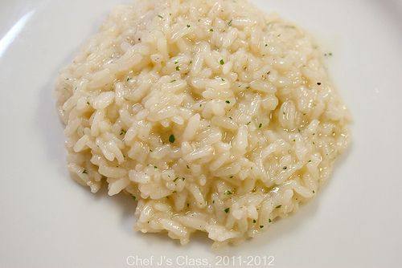
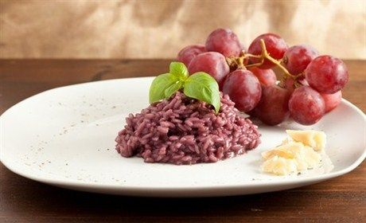

---risotto-red
image: ../../pics/risotto.jpg
---
# Ризотто

## История

Упоминание о блюде, отдаленно напоминающем ризотто, относится к 1700 году. В книге неизвестного автора, книга называется «Oniatologia» \( наука о еде\). Рецепт: «Per far zuppa di riso alla Milanese» \(Как сделать суп с рисом по-милански\), где рис отваривается в соленой воде, в процессе варки добавляется сливочное масло, ароматизируется корицей, добавляется тертый пармиджано и 6 желтков для придания рису желтого цвета.

В 1809 году в Милане выходит книга под названием «Cuoco moderno» - «Современный повар», за авторством таинственного L.O.G. Здесь рецепт назван: «Riso giallo in padella» \( Желтый рис приготовленный в сковороде\). Рецепт гласит: Готовьте рис, изначально припущенный с обжаркой из сливочного масла, cervellato \(миланский сервелат\), костного мозга, лука, добавляя постепенно горячий бульон, в котором был размочен шафран.

В 1829 выходит книга знаменитого миланского повара Феличе Лураски под названием «Nuovo cuoco milanese economico» - « Новый миланский экономичный шеф-повар». Рецепт назван: «Миланское желтое ризотто», с употреблением жира, костного мозга, шафрана, мускатного ореха, бульона, с добавлением сервелата и тертого сыра.

Про добавление вина здесь еще не говорится.

В начале 1900 Артузи предлагает свои два рецепта «Ризотто по-милански». В первом вино не упоминается, но в нем нет ни костного мозга, ни других жиров. Второй рецепт Артузи называет более тяжелым для желудка, но в тоже время и более вкусным, и здесь уже появляется костный мозг и вино. Артузи понял, что жирность придает определенный вкус блюду и в тоже время нуждается в кислотности вина для уменьшения сальности и для придания силы ризотто.

#### Приготовление

Очистить и порезать лук очень мелкими кубиками.

Поставить на огонь кастрюлю с бульоном, довести до кипения и убавить огонь до минимального.

В сковороде с высокими бортиками или широком сотейнике разогреть оливковое масло и обжарить лук с чесноком до их прозрачности и сладкого аромата, затем добавить рис и обжарить также до прозрачности, постоянно помешивая в течении 5 мин.

Влить в сковороду вино и готовить, помешивая, пока вино не выпарится. Уменьшить огонь до чуть ниже среднего, добавить половник горячего бульона и постоянно помешивать, пока бульон не выпарится, только тогда влить следующий половник бульона. Варить ризотто 10 мин., мешая и подливая бульон, бульона может понадобиться чуть больше или меньше, до полной готовности, около 18 минут.

Снять с огня. На этом этапе ризотто должно быть чуть жиже, чем надо. Добавить холодное сливочное масло и тертый сыр пармезан. Накрыть сковороду крышкой и оставить на 10 мин.

*lyukum.livejournal.com*
