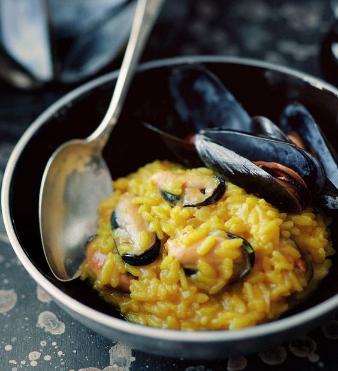

---
image: ../../pics/risotto-ai-frutti-di-mare.jpg
---
# Ризотто с морепродуктами

#### Ингредиенты
на 2 порции

* микс морепродуктов 400 г
*или* 10 - 15 мидий \(в скорлупе, можно замороженных\)
* вода или овощной бульон
* кусок пармезана или Грана Падано
* 1 чайная ложка томатной пассаты \(можно заменить помидором, растертым в пюре и смешанным с томатной пастой\)
* 25 г сливочного масла
* рис для ризотто 200 г \(1 полная чашка\)
* белое вино 65 г
* шафран щепотка
* сливочное масло 30 г
* 40 г тертого пармезана или грана падано

#### Приготовление

Разморозить мидий, промыть под струей холодной воды. Все ракушки на 1,5-3 часа положить в большую чашку с холодной водой с морской солью. Эта манипуляция помогает избавиться от песка. Почистить ракушки, ножницами вырезать водоросли, растущие внутри раковин, обсушить.  
Все ракушки на 1,5-3 часа положить в большую чашку с холодной водой с морской солью. Эта манипуляция помогает избавиться от песка.  
В большую сковороду высыпать ракушки, держать под крышкой пару минут, пока не раскроются все раковины. Очистить.

Добавить в бульон томатную пассату, довести до кипения. Приготовить [ризотто](https://mars9n9.github.io/%D0%9F%D0%B0%D1%81%D1%82%D0%B0%20%D0%B8%20%D1%80%D0%B8%D0%B7%D0%BE%D1%82%D1%82%D0%BE/%D0%A0%D0%B8%D0%B7%D0%BE%D1%82%D1%82%D0%BE/ix.html) с шафраном.

В готовое ризотто добавить морепродукты без раковин, прогреть. Подавать украсив мидиями в раковинах.

*kwestiasmaku.com*
