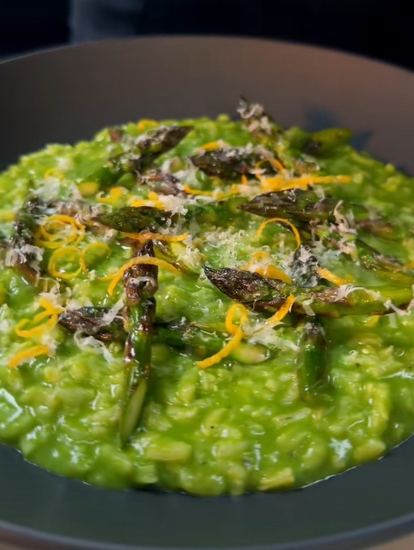

# Ризотто со спаржей и шпинатом

#### Ингредиенты
2 порции

* зубчик чеснока
* сливочное масло 30 г
* рис арборио
* белое вино 70 мл
* куриный бульон
* пучок спаржи
* молодой шпинат 50 г
* пармезан 20 г
* цедра 1 лимона

#### Приготовление

Чеснок мелко нарезать, спаржу очистить, жесткие концы удалить.

Приготовить [ризотто](https://mars9n9.github.io/%D0%9F%D0%B0%D1%81%D1%82%D0%B0%20%D0%B8%20%D1%80%D0%B8%D0%B7%D0%BE%D1%82%D1%82%D0%BE/%D0%A0%D0%B8%D0%B7%D0%BE%D1%82%D1%82%D0%BE/ix.html).

Бланшировать спаржу и шпинат в кипящей воде, затем окунуть в ледяную воду. Отжать лишнюю воду из зелени, положить ее в блендер и измельчить до однородной массы. 

После того, как ризотто приготовится, вылить пюре в ризотто, добавить пармезан, масло и цедру лимона, приправить солью по вкусу. Тщательно перемешать до полного смешивания и эмульгирования.
Обжарить кончики спаржи с небольшим количеством масла.

Подавать ризотто в мисках, украсив кончиками спаржи, цедрой лимона, пармезаном и сбрызнув оливковым маслом.

*tiktok: samseats*
