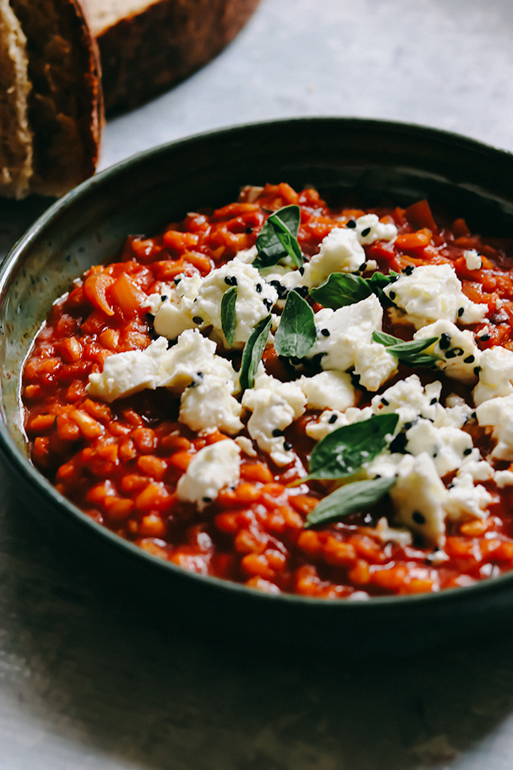

---
image: ../../pics/risotto-barley-feta.jpg
---
# Перлотто с маринованной фетой

#### Ингредиенты
2 порции

* перловая крупа 100 г
* сливочное масло 15 г
* оливковое масло 30 г
* стебель сельдерея
* чеснок 2 зубчика
* тимьян 2 веточки
* копченая паприка 1/4 ч л
* лавровый лист
* чили хлопья 1/8 ч л
* лимонная цедра 2 полоски
* томаты консервированные 200 г
* овощной бульон 350 г
* томатная пассата 150 г
* семена тмина 1/2 ст л
* фета 150 г
* орегано свежее 1/2 ст л
* соль

#### Приготовление

Подготовить все ингредиенты. Чеснок мелко нарезать, сельдерей нарезать кусочками по 5 мм, фету нарезать кусочками по 2 см. Хорошо промыть перловую крупу и дать стечь воде. Бульон довести до кипения.

Растопить сливочное масло и 1 столовую ложку оливкового масла в очень большой сковороде и обжарить сельдерей и чеснок на медленном огне 5 минут или до мягкости. Добавить перловую крупу, тимьян, паприку, лавровый лист, лимонную цедру, хлопья чили, помидоры, бульон, пассату и 1/4 столовой ложки соли. Перемешать, довести смесь до кипения, затем уменьшить огонь и варите 45 минут, часто помешивая, чтобы ризотто не пригорело ко дну сковороды. Когда ризотто будет готово, перловая крупа должна стать мягкой, а большая часть жидкости впитаться.

Тем временем обжарить семена тмина на сухой сковороде в течение нескольких минут. Затем слегка измельчить их, чтобы осталось немного целых семян. Добавить их к фете с оставшимся оливковым маслом и аккуратно перемешать.

Подавать перлотто, выложив сверху маринованную фету

*Jerusalem Cookbook | Ottolenghi*
