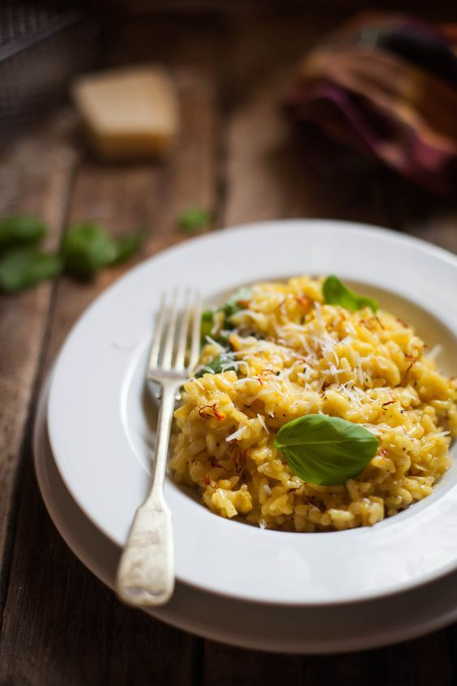

---
image: ../../pics/risotto-milanese.jpg
---
# Ризотто по-милански \| Risotto Milanese

#### Ингредиенты

* 350 г риса \(”carnaroli“, “arborio” или “vialone nano”\)
* 50гр сливочного масла \(отличного качества\)
* 40гр костного мозга
* 1\2 луковицы
* 1 литр мясного бульона
* Шафран \(1 ч л натурального или пара щепоток рылец\)
* 1\2 стакана белого сухого вина
* 2 ложки тертого сыра Пармиджано Реджано

#### Приготовление

В небольшой части бульона вымочить шафран.  
Приготовить [ризотто](https://mars9n9.github.io/%D0%9F%D0%B0%D1%81%D1%82%D0%B0%20%D0%B8%20%D1%80%D0%B8%D0%B7%D0%BE%D1%82%D1%82%D0%BE/%D0%A0%D0%B8%D0%B7%D0%BE%D1%82%D1%82%D0%BE/ix.html) с шафраном, вместо масла использовать костный мозг.
