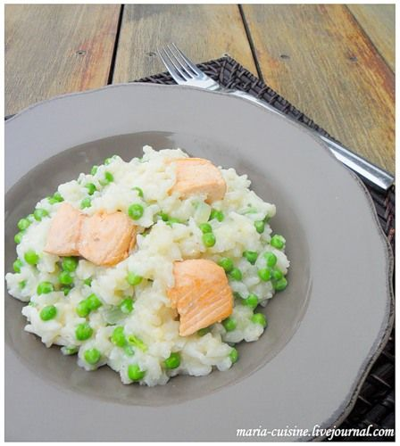

---
image: ../../pics/risotto-salmon-peas.jpg
---
# Ризотто с лососем и зелёным горошком \| Risotto au saumon et petits pois

#### Ингредиенты
на 4 порции

* 400 г филе лосося
* 200 г риса для ризотто
* 150 г зелёного горошка
* 50 г тертого пармезана
* 40 г сливочного масла
* 500 мл рыбного бульона
* 150 мл белого сухого вина
* 1 луковица
* 4 ст.л. оливкового масла

#### Приготовление

Горошек отварить 5 мин в кипящей солёной воде, затем быстро переложить его в ледяную воду, чтобы сохранить красивый цвет.  
Приготовить [ризотто](https://mars9n9.github.io/%D0%9F%D0%B0%D1%81%D1%82%D0%B0%20%D0%B8%20%D1%80%D0%B8%D0%B7%D0%BE%D1%82%D1%82%D0%BE/%D0%A0%D0%B8%D0%B7%D0%BE%D1%82%D1%82%D0%BE/ix.html) с шафраном и рыбным бульоном.  
В это время лосось нарезать на кубики и обжарить на оставшемся оливковом масле, посолить и поперчить.  
В готовое ризотто добавить горошек и пармезан, перемешать.
При подаче в тарелку выложить кусочки лосося.

*lg: maria-cuisine*
