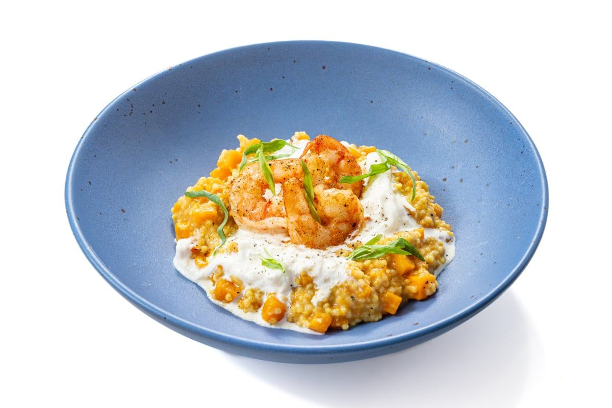

---
image: ../../pics/risotto-tikva-krevetka.jpg
---
# Ризотто из пшена с тыквой и креветками

#### Ингредиенты
2 порции

* Пшено: 140 г
* Тыква: 300 г
* Креветки: 6 штук
* Сливочное масло: 50 г
* Сыр пармезан: 50 г
* Белое сухое вино: 100 мл
* Репчатый лук: 50 г
* Чеснок: 2 зубчика
* Куриный бульон: 600 мл
* Сыр страчателла: 80 г
* Оливковое масло: 30 мл
* Тархун: 1 веточка
* Соль: по вкусу
* Молотый черный перец: по вкусу

#### Приготовление

Подготовить все ингредиенты. Лук и зубчик чеснока мелко нарезать. Тыкву нарезать кубиками со стороной около 1 см.  
Приготовить [ризотто](https://mars9n9.github.io/%D0%9F%D0%B0%D1%81%D1%82%D0%B0%20%D0%B8%20%D1%80%D0%B8%D0%B7%D0%BE%D1%82%D1%82%D0%BE/%D0%A0%D0%B8%D0%B7%D0%BE%D1%82%D1%82%D0%BE/ix.html) с пшеном, добавить тыкву через 5 минут после пшена.

Тыльной стороной ножа раздавить зубчик чеснока. На отдельной сковороде разогреть оставшееся сливочное масло, бросить туда чеснок и быстро обжарить креветки по минуте с каждой стороны, посолить и поперчить.

Подавать ризотто из пшена с тыквой и креветками сразу же, украсив страчателлой и листьями тархуна.

*eda.ru*
