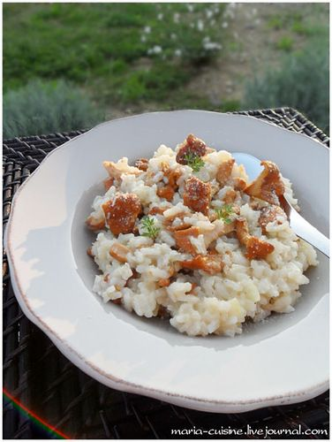

---
image: ../../pics/6048af3e88c28f8c6cdb68354d7a53b5.jpg
---
# Ризотто с лисичками. Ванильное \| Risotto aux girolles

#### Ингредиенты

4 порции:

* рис для ризотто - 200 гр
* лук репчатый - 1 шт
* белое сухое вино - 150 мл
* бульон \(или вода\) - 500 мл
* оливковое масло - 4 ст.л.
* сливочное масло - 40 гр
* пармезан тёртый - 50 гр
* соль, перец
* лисички
* ванильный сахар \(опционально, сахар именно с натуральной ванилью, а не ванилином\)

#### Приготовление

Приготовить [ризотто](https://mars9n9.github.io/%D0%9F%D0%B0%D1%81%D1%82%D0%B0%20%D0%B8%20%D1%80%D0%B8%D0%B7%D0%BE%D1%82%D1%82%D0%BE/%D0%A0%D0%B8%D0%B7%D0%BE%D1%82%D1%82%D0%BE/ix.html).  
Обжарить лисички на оливковом масле \(из них должна выпариться вся жидкость\).  
В готовое ризотто добавить пармезан, большую щепотку ванильного сахара и лисички, хорошо перемешать.  
Подавать сразу.

*maria-cuisine.livejournal.com*
