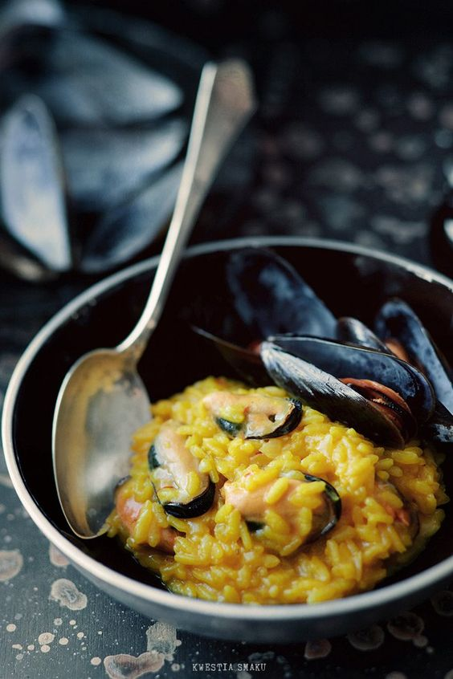

# Ризотто с мидиями

#### Ингредиенты

* 10 - 15 мидий \(в скорлупе, можно замороженных\)
* 1 литр воды или овощного бульона
* кусок пармезана или Грана Падано
* 1 чайная ложка томатной пассаты \(можно заменить помидором, растертым в пюре и смешанным с томатной пастой\)
* 25 г сливочного масла
* 1/2 лука
* 200 г \(1 полная чашка\) риса для ризотто
* 1/4 стакана белого вина
* 1/3 чайной ложки шафрана
* 30 г сливочного масла
* 40 г тертого пармезана или грана падано

#### Приготовление

Разморозить мидий, промыть под струей холодной воды \(почистить ракушки, ножницами вырезать водоросли, растущие внутри раковин\), обсушить. Очистить мидии, залить водой или бульоном, добавить оливковое масло и соль по вкусу, накрыть крышкой и довести до кипения варить 4-5 минут. Процедить бульон через сито в другую кастрюлю, удалить мидии из раковин, оставив несколько целых моллюсков для украшения.

Добавить в бульон томатную пассату, довести до кипения. Приготовить [ризотто](https://mars9n9.github.io/%D0%9F%D0%B0%D1%81%D1%82%D0%B0%20%D0%B8%20%D1%80%D0%B8%D0%B7%D0%BE%D1%82%D1%82%D0%BE/%D0%A0%D0%B8%D0%B7%D0%BE%D1%82%D1%82%D0%BE/ix.html) с шафраном.

В готовое ризотто добавить мидии без раковин. Подавать украсив мидиями в раковинах.

*www.kwestiasmaku.com*
