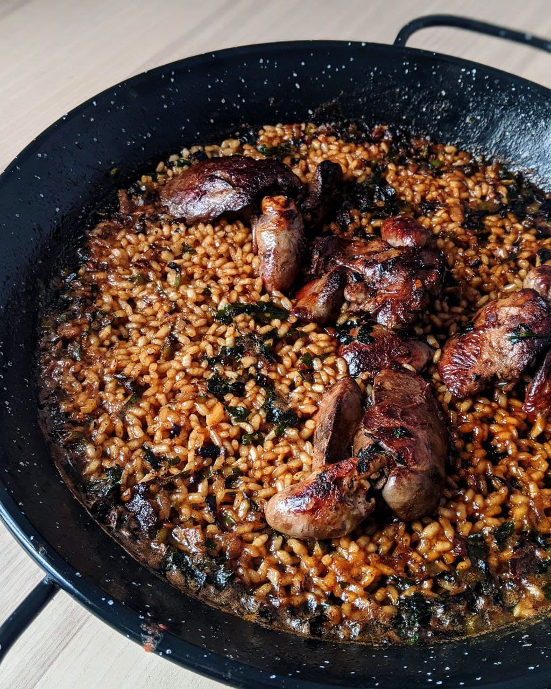

---
image: ../pics/paella-kurica.jpg
---
# Паэлья из куриных потрохов

#### Ингредиенты

на сковороду с внутренним диаметром 22-24 см

* куриные потроха 150-230 г
* рис ризотто 400 г (2 мерки)
* пассата 100 г
* чеснок 1-2 зб.
* петрушка 1 ст.л.
* бульон или горячая вода 450 мл
* оливковое масло 10-15 мл
* соль, паприка, хлопья перца, сухой чеснок

#### Приготовление

Сковороду разогреть на средне-сильном огне, добавить оливковое масло, потроха и чеснок, обжарить.  
Добавить специи и помидор, выпарить всю жидкость, активно помешивая, должна остаться густая коричневая паста. Добавить петрушку, рис, горячий бульон, соль. Перемешать и с этого момента сковородку не трясти и больше рис не перемешивать.  
Довести до кипения, дальше убавить огонь до минимального, варить ещё 16-18 мин.

*@ElCaminoBCN*
