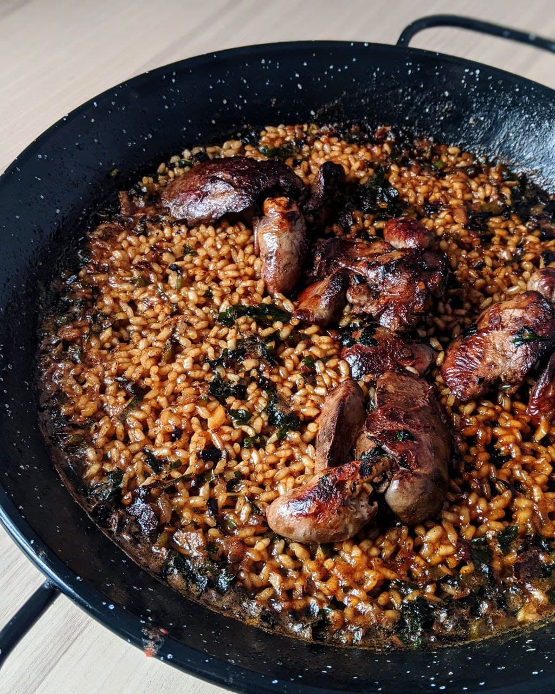

# Паэлья из куриных потрохов

#### Ингредиенты

на сковороду с внутренним диаметром 22-24 см

* куриные потроха 150-230 г
* Рис бомба или для суши 80 г
* Зелёный перец мелкими кубиками 30 г
* Лук мелкими кубиками 20 г
* Тёртый томат без кожуры 100 г
* Чеснок тёртый 1-2 зб.
* Петрушка порубленная 1 ст.л.
* Бульон или горячая вода 250-300 мл
* Оливковое масло 10-15 мл
* Соль

#### Приготовление

Сковороду разогреть на средне-сильном огне, добавить оливковое масло, потроха, лук и перец. Жарить до готовности овощей. Они будут мягкими и золотистыми. В процессе активно перемешиваем содержимое сковороды. Добавить чеснок и помидор, выпарить всю жидкость из томата, активно помешивая, должна остаться густая коричневая паста. Добавить петрушку, рис, бульон, соль и вода. Перемешать и с этого момента сковородку не трясти и больше рис не перемешивать. Варить 5 мин, дальше убавить огонь до минимального, варить ещё 16-18 мин.

*@ElCaminoBCN*
