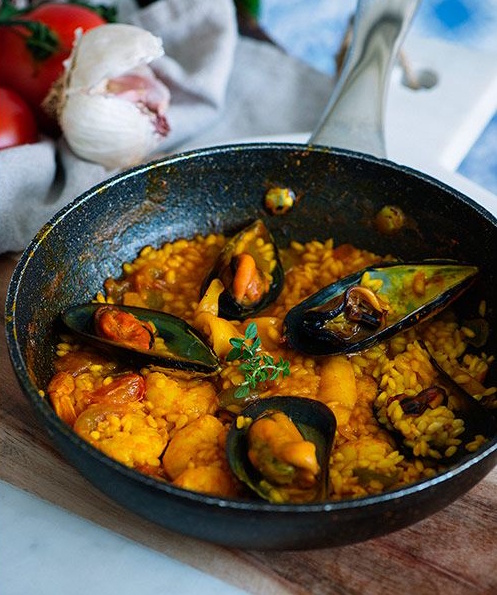

---
image: ../pics/paella.jpg
---
# Паэлья с морепродуктами

#### Ингредиенты

на 6 порций

* крупные креветки 500 г
* мидии 1 кг 
* 1 кальмар
* 3 помидора или пассата 400 г
* 3 зубчика чеснока
* 1 зеленый перец
* рис круглый 400 г
* 1 литр куриного или рыбного бульона
* белое вино 60 мл
* щепотка шафрана
* 1 маленькая щепотка измельченного красного перца
* 1 ч. л. паприки
* 1 ч. л. копченой паприки
* 1 ч. л. пасты из анчоусов
* соль и масло
* *чоризо сырая 120 г - опционально*
* *очищенные мелкие креветки - опционально*

#### Приготовление
Положить очищенные мелкие креветки в среднюю миску, добавить 1 ст. л. масла, измельченный чеснок, измельченный красный перец и щепотку соли и перца, перемешать. Накрыть и оставить в холодильнике.

Заварить шафран в кипятке. Очистить и нарезать помидоры. Чоризо разрезать и вынуть фарш.

Хорошо разогреть сковороду на сильном огне. Когда сковорода нагреется, добавьте масло, обжарить морепродукты и отложить на тарелку. Добавить фарш из чоризо и готовить, пока он слегка не подрумянится.

Приготовить софрито - это овощная основа (чеснок, помидоры и т. д.), приготовленная с паприкой до тех пор, пока специи не пропитают ингредиенты. Чем дольше готовится софрито , тем темнее и насыщеннее будет паэлья. 

Сдвинуть фарш к краям сковороды. В центр выложить целые зубчики чеснока, обжарить. Добавить помидоры, их соки, специи, анчоусную пасту, слегка приправить солью и перцем, готовить около 5 минут.

Добавить вино, чтобы дегласировать сковороду, затем добавить рис и обжарить его. Медленно влить горячий бульон и заваренный шафран и хорошо перемешать все, равномерно распределить рис. Накрыть крышкой и варить на среднем огне 10-15 минут. Когда останется тонкий слой жидкости, убавить огонь до минимума, добавить морепродукты, снова накрыть крышкой и готовить, пока рис не впитает оставшуюся жидкость. Выключить нагрев и дать настояться пол часа.

Перед подачей сбрызнуть лимонным соком, украсить зеленью петрушки и дольками лимона.
