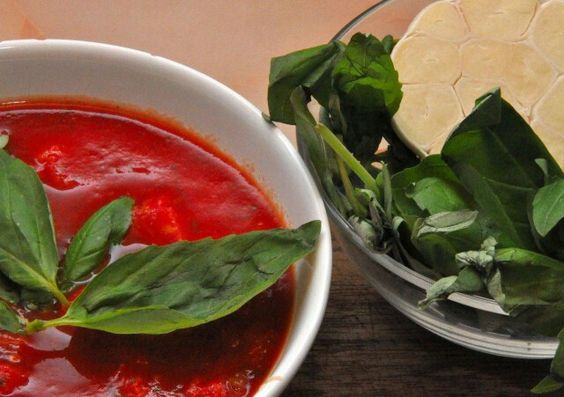

# Базовый томатный соус для пиццы

#### Ингредиенты

* 1 кг томатов пелати
* 20 г зеленого базилика.
* 2 - 3 ч. л. оливкового масла extra virgin
* Соль , перец

#### Приготовление

Помидоры протереть блендером (взбивать не нужно, иначе соус по­теряет цвет). Нарвать в соус ­руками листья базилика, влить оливковое масло, приправить солью и перцем и пере­мешать.

*eda.ru*
