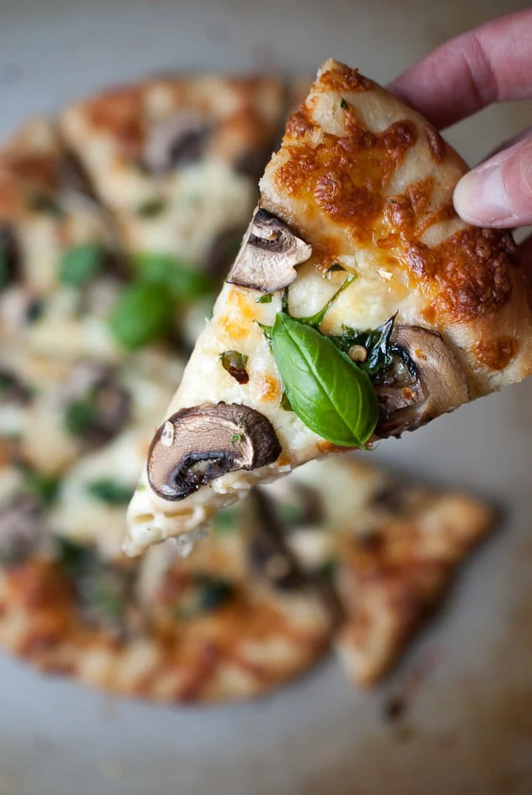

---
image: ../pics/Garlic-Mushroom-Spinach-Pizza-5.webp
---
# Пицца с грибами, чесноком и шпинатом

#### Ингредиенты

* тесто для пиццы - 250 г
* 2 зубчика чеснока
* 100 г тертого сыра моцарелла
* ложка сметаны
* 100 г нарезанных грибов
* горсть  свежего шпината
* свежий базилик
* хлопья красного перца

#### Приготовление

Разогреть духовку до 250 градусов.
Тесто сформовать в лепешку, дать отдохнуть 15 минут, подсушить в духовке, в течение пяти минут.  
Смазать тесто для пиццы сметаной. Равномерно посыпать чесноком, сыром, грибами и шпинатом. Выпекать 10–12 минут, пока сыр не начнет пузыриться, а корочка не станет золотистой.
Достать из духовки и посыпать сверху свежим базиликом и хлопьями красного перца.

*lifeisbutadish.com*
