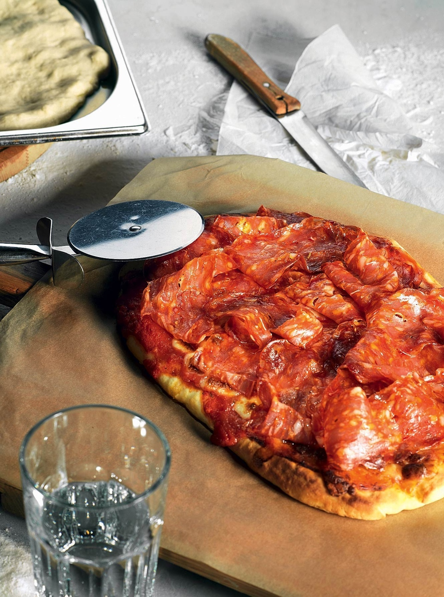

---
image: ../pics/picca-saljami-pikante_35394_photo_23767.jpg
---
# Пицца «Салями пиканте»

#### Ингредиенты
на 4 порции

* тесто для пиццы - 250 г
* томатный соус - 70 г
* сыр моцарелла для пиццы - 100 г
* острая салями - 50 г

#### Приготовление

Разогреть духовку до 250 градусов.
Тесто сформовать в лепешку, дать отдохнуть 15 минут, подсушить в духовке в течение пяти минут.  
Равномерно выложить на тесто томатный соус, а сверху — кубики моцареллы. Вернуть в духовку на пять минут.  
На готовую пиццу выложить, слегка скручивая, ломти колбасы — и немедленно, пока пицца не остыла, подавать.

*eda.ru*
