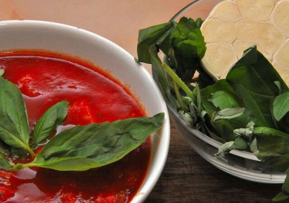

---
image: ../pics/tomato-sauce.jpg
---
# Базовый томатный соус для пиццы

#### Ингредиенты

* томаты пелати 1 кг
* зеленый базилик 20 г
* оливковое масло extra virgin 2-3 ч л
* Соль, перец

#### Приготовление

Помидоры протереть блендером (взбивать не нужно, иначе соус по­теряет цвет). Нарвать в соус ­руками листья базилика, влить оливковое масло, приправить солью и перцем и пере­мешать.

*eda.ru*
