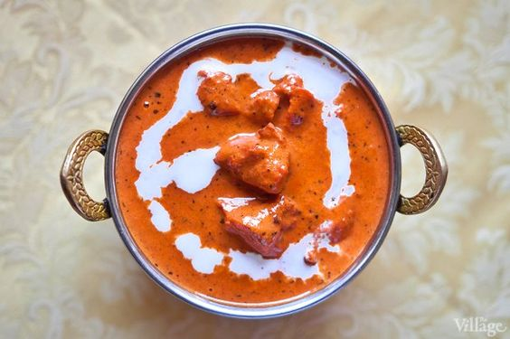

# Баттер Чикен \| Butter Chicken \| Murgh makhani

«Баттер Чикен» — одно из самых популярных традиционных блюд Северной Индии, оно отличается нежной текстурой и мягким, сливочным вкусом. Кроме этого, курица в сливочном соусе не так остра, как большинство блюд индийской кухни.

Традиционно для этого рецепта используется курица тандури — специально замаринованная и приготовленная в большой керамической печи-жаровне. Томление мяса в печи можно заменить лёгкой обжаркой на раскалённой сковороде. При этом использовать лучше не грудку, а филе с бедра. В этом случае блюдо выйдет наиболее аутентичным.

#### Ингредиенты
4 порции

* Курица целая 1.5 кг
* Имбирь: 40 г
* Чеснок: 8 зубчиков
* Зеленый перец чили : 2 штуки
* Топленое масло: 60 г
* Консервированные помидоры кусочками: 800 г
* Молотый перец чили: 1 чайная ложка
* Пажитник: 1 чайная ложка
* Кардамон: 5 штук
* Гвоздика: 2 штуки
* Палочки корицы: 1 штука
* Сливки: 150 мл
* Черные семена кардамона : 1 штука
* Соль: по вкусу
* Сахар: по вкусу
* Кинза: по вкусу

**для маринада**

* Натуральный йогурт: 200 г
* Соль 1 ч. л.
* Листья пажитника: 5 г
* Куркума: 1 чайная ложка
* Гарам-масала: 2 чайные ложки
* Имбирь: 20 г
* Чеснок: 1 зубчик

#### Приготовление

Разделать курицу на небольшие куски: голени, бедра, крылышки, грудки, разрезанные пополам. Смешать йогурт, листья пажитника, куркуму, гарам-масалу, зубчик давленого чеснока, 20 г измельченного имбиря и чайную ложку соли. Покрыть этим маринадом курицу, накрыть пленкой и убрать в холодильник минимум на 4 часа.

Обжарить мясо на раскалённом растительном масле со всех сторон. В целом не больше 4-5 минут. Избавить от излишков жира при помощи бумажных полотенец и дать немного остыть.

В толстостенной кастрюле разогреть топленое масло, добавить кардамон, гвоздику и корицу, жарить пару минут до появления пряного аромата. Добавить пажитник, 8 зубчиков измельченного чеснока, 40 г измельченного имбиря и мелко нарезанный зеленый чили. Готовить, помешивая, еще 4 минуты. Добавить помидоры, молотый чили и соль, перемешать и готовить 30 минут под крышкой на небольшом огне.

Добавить курицу, перемешать, посыпать гарам-масалой, добавить соль и сахар по вкусу и готовить еще 10 минут.

Влить сливки, перемешать, довести до кипения и снять с огня. Готовое блюдо украсить рубленой кинзой.

Подавать с рисом басмати

*the-village.ru*
