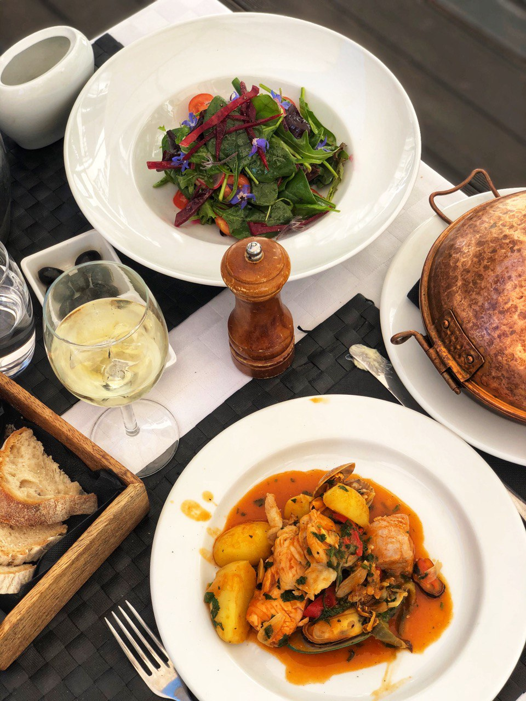

---
image: ../pics/photo_2022-11-10_13-48-39.jpg
---
# Сaldeirada

#### Ингредиенты

* 800 г белой рыбы (лучше треска),
* 10 крупных креветок
* 10-12 мидий в ракушках
* 500 грамм картошки
* 4 зубка чеснока
* 2 крупных мясистых помидора или консерированные помидоры
* 60 мл белого вина
* 1 л рыбного или овощного бульона
* 2 чайные ложки рыбного соуса
* Щепоть шафрана
* молотая гвоздика
* четверть чайной ложки копченой паприки
* соль-черный перец по вкусу
* пол чайной ложки сахара
* пара веточек тимьяна
* 2 лавровых листика

#### Приготовление

Мелко нарезать чеснок. Нарезать помидоры кубиками.  
В сотейнике, небольшом казанке или сковородке с высокими бортами, на оливковом масле обжарить чеснок, добавить помидоры, тушить 3-4 минуты. Влить вино, дать выпариться алкоголю.  
Добавить бульон и все специи, дать закипеть.  
Очистить картофель, нарезать крупным кубиком. Нарезать рыбу на куски примерно 3-5 см.  
Добавить картофель, и готовить почти до готовности, после добавить рыбу, готовить минут 5, перемешивать аккуратно, иначе рыба развалится. Затем добавить морепродукты, перемешать, оставить на 3-4 минуты.  
Посыпать петрушкой, и оставить настояться минут на 30.  
Подавать всего с поджаренным хлебом, натертым чесноком.

*https://t.me/sestrytokarevy*
