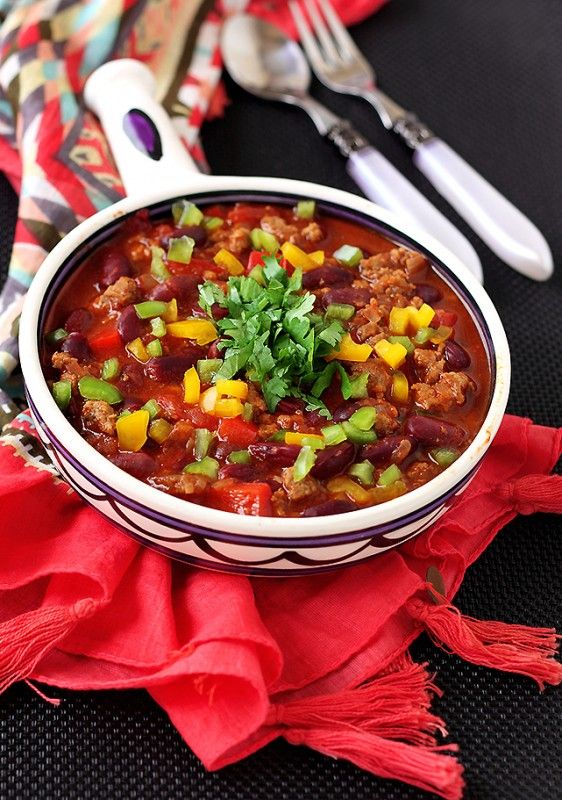
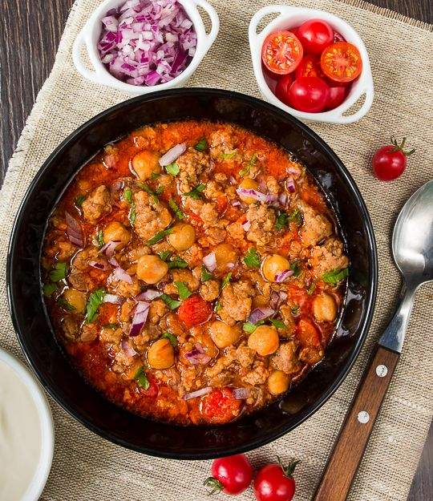

# Чили с говядиной \| Chilli Con Carne

#### Ингредиенты

* крупный говяжий фарш 600 гр \(можно брать свиной фарш\)
* 200 гр репчатый лук
* 4 зубчика чеснока
* 2 зеленых чили перца \(или по вкусу если не любите острое\)
* 800 гр консервированная красная, черна, белая фасоль
* 600 гр консервированные томаты\(нарезанные\)
* 2 ст.л томатная паста
* 700 мл говяжий бульон
* 3 ст.л оливковое масло
* 50 мл бальзамический уксус
* 3 ст л коричневый сахар

**cпеции:**

* 1.5 ч.л молотый кумин
* 1 ч л порошка чили
* 1 ч л копченой парики
* 2 ч.л орегано
* 1/2 ч.л корица
* 1 ч.л сушеный кориандр
* 1 лавровый лист
* соль по вкусу

**для подачи:**

* кинза 1 пучок
* тертый сыр
* авокадо
* сметана
* начос
* красный лук

#### Приготовление

Лук, чеснок, перцы очистить и нарезать. Раскалить масло и обжарить лук,чеснок и чили перец около 5 минут. Добавить специи и готовить ещё минуту.  
Добавить мясной фарш и, разбивая фарш деревянной лопаткой, готовить до испарения жидкости, чтобы фарш немного зарумянился.  
Добавить томаты, томатную пасту, бальзамический уксус, сахар, готовить 1 минуту помешивая.  
Влить бульон. Дать закипеть, убавить огонь.
Готовить под крышкой на медленном огне пока фасоль не разварится.

Готовое блюдо посыпать кинзой, снять с огня и настоять под крышкой 5 минут.

Подавать с отварным рисом на гарнир. Можно посыпать тертым сыром, добавить авокадо, ложку сметаны и начос. Отдельно подают красный лук и свежие помидоры

_можно использовать не консервированную фасоль, тогда нужно замочить фасоль на ночь. Вместо консервированных томатов можно использовать бланшированные и очищенные томаты, нарезать их кубиком._

*naturallyella.com*

## Чили из свинины с нутом

300 г отваренного или консервированного нута

Добавить нут за 5 минут до готовности

*vkusnyblog.ru*
