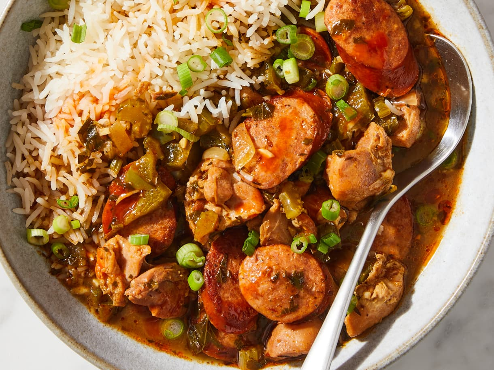

# Гамбо

#### Ингредиенты

* 1 средний зеленый болгарский перец
* 1 средняя луковица
* 6 зубчиков чеснока
* томаты консервированные 400 г
* окра 200 г
* свежая петрушка ½ пучка
* кайджунская приправа 2–3 ст л
* сушеный тимьян 2 ч л
* лавровый лист
* кайенский перец ½ ч л
* куриные бедра без кожи и костей 450 г
* колбаса андуй 200 г
* креветки крупные 250 г
* куриный бульон 500 мл
* сливочное масло 60 г
* мука 60 г
* растительное масло
* соль
* перец

**для кайджунской приправы:**
* паприка 1½ ч л
* чесночный порошок 1½ ч л
* черный перец молотый 3/4 ч л
* сушеное орегано 3/4 ч л
* сушеный тимьян 3/4 ч л

**для подачи:**
* зеленый лук 1/2 пучка
* вареный белый рис
* острый соус Crystal или Tabasco

#### Приготовление

Нарезать зеленый перец кубиком, измельчить чеснок, нарезать петрушку, нарезать окру поперек. Смешать все овощи, добавить 2 ст л кайджунской приправы, сушеный тимьян, лавровый лист, кайенский перец, и перемешать. 

Нарезать курицу на небольшие кусочки, добавить соль, черный перец, 1 ст л кайджунской приправы. Нарезать колбасу, обжарить до румяности с обеих сторон, выложить на тарелку. В той же сковороде обжарить курицу с обеих сторон, выложить к колбасе.

Приготовить ру. Уменьшить огонь до среднего. Соскрести деревянной ложкой пригоревшие кусочки со дна кастрюли. Добавить сливочное масло, растопить, добавить муку и обжарить, постоянно помешивая и соскребая муку со дна кастрюли деревянной ложкой, пока ру не приобретёт цвет и текстуру, напоминающие растопленный молочный шоколад, 10–20 минут. Добавить овощи, хорошо перемешать и обжарить. Добавить помидоры, измельчить и обжарить.

В кастрюлю выложить овощи, добавить мясо и бульон, довести до кипения. Уменьшить огонь до слабого и варить без крышки, пока гумбо слегка не загустеет и не смешаются ароматы, 35–45 минут.

За 10 минут до готовности добавить креветки.

Подавать с вареным рисом, зелёным луком, каплей острого соуса. 

*thekitchn.com*
