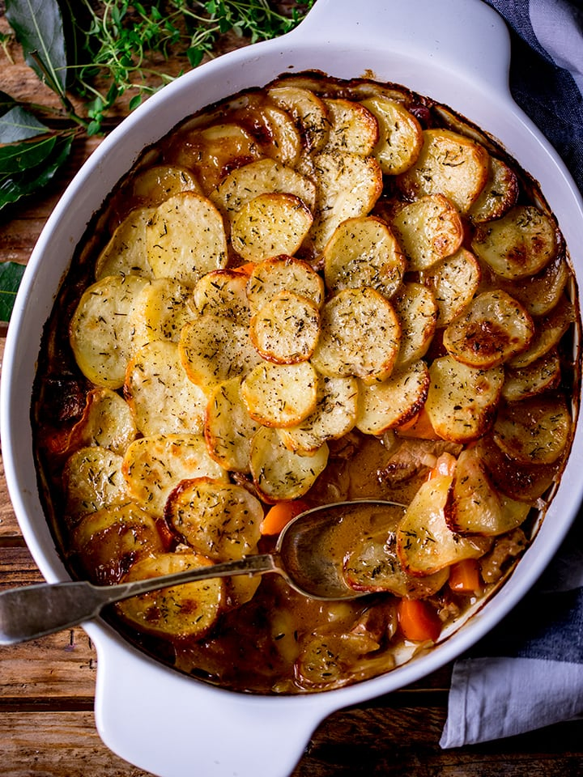

---
image: ../pics/lancashire-hotpot.webp
---
# Рагу по-ланкаширски

#### Ингредиенты

* баранья лопатка 500 г
* бараньи почки 150 г
* 4 моркови
* 1 большая луковица
* 2 зубчика чеснока
* мука  2 ст л
* куриный бульон 300 мл
* красное вино 200 мл
* вустерский соус 1 ст л
* 4 крупных картофеля
* кровяная колбаса 200 г
* 1 букет гарни
* сливочное масло 100 г
* свежие веточки тимьяна
* Соль и перец по вкусу

#### Приготовление

Баранью лопатку нарезать кубиками, почки - ломтиками, приправить солью и перцем. В большой сковороде обжарить баранью лопатку и почки на среднем огне до золотистого цвета, вынуть и выложить в тарелку.

Морковь нарезать колечками, чеснок измельчить, обжарить в той же сковороде до мягкости. Посыпать мукой, тщательно помешивая, чтобы покрыть овощи. Влить куриный бульон и красное вино, хорошо перемешать. Добавьте букет гарни, вустерский соус и луковицу.

Вернуть баранину и почки в сковороду, хорошо перемешать, тушить на медленном огне 20 минут. 

Разогреть духовку до 180 °C. 

Картофель и кровяную колбасу нарезать кружочками. В кастрюлю для запекания выложить слоями картофель внахлест, затем рагу, ломтики кровяной колбасы, картофель, рагу, кровяную колбасу и снова картофель, так чтобы скрыть всю начинку. Положить сверху сливочное масло кубиками, приправить солью и перцем. Накрыть кастрюлю крышкой или фольгой и поставить в духовку. Запекать 1 час под крышкой, затем 30 минут без крышки, чтобы картофель стал хрустящим и подрумянился. Украсите веточками тимьяна перед подачей.

*Tiktok: foodwithgeorge*