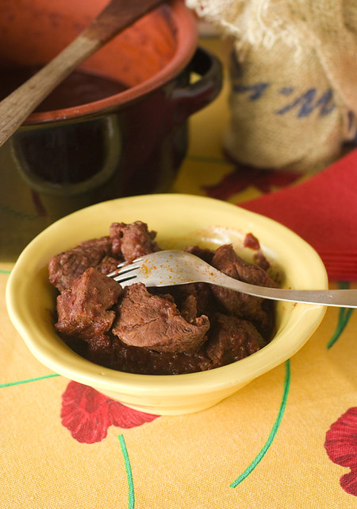

# Острая телятина \| Peposo Alla Fornacina

Пепозо алла форначина - тосканское острое блюдо из телятины.

#### Ингредиенты:

на 4 порции

* 1 кг телятины \(передняя часть ноги или задняя часть голяшки\)
* 400 г очищенных помидоров
* 4 зубчика чеснока
* 100 мл вина Кьянти
* вода
* 2 ч. л. свежемолотого черного перца
* соль

#### Приготовление:

Телятину порезать небольшими кусками. Мелко порубить чеснок. В глубокую кастрюлю выложить мясо, мелкорубленный чеснок, порезанные помидоры и молотый перец. Залить все водой так, чтобы она полностью покрывала мясо сверху примерно на 3 пальца.  
  
Накрыть кастрюлю крышкой и поставить мясо вариться на очень медленном огне – примерно в течение 2 часов.Постоянно помешивать, чтобы мяо не пригорало ко дну кастрюли. Спустя 2 часа добавить к мясу вино, посолить и оставьте тушиться еще на один час.

Готовую телятину подавать в горячем виде.

[_http://elladkin.livejournal.com/417107.html_](http://elladkin.livejournal.com/417107.html)

