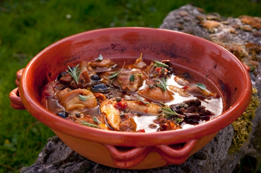

---
image: ../pics/pollo-alla-cacciatora.jpg
---
# Курица по-охотничьи \| Pollo alla cacciatora

#### Ингредиенты

* небольшая курица 1,5 кг
* 2 средних моркови
* 1 большой белый лук
* очищенные помидоры в собственном соку 300 г
* зубчик чеснока
* овощной бульон 1 л (максимум)
* белое сухое вино 80 мл
* маслины с косточкой 80 г
* каперсы 10 г
* 1 веточка розмарина
* 1 веточка шалфея
* 2 веточки тимьяна
* 1 острый красный стручковый перец
* оливковое масло холодного отжима
* свежемолотый белый перец
* соль

#### Приготовление

Курицу нарезать небольшими кусками, помыть под холодной водой и обсушить бумажными полотенцами. Почистить морковь и лук. Нарезать овощи средними кубиками.

В сковороде спассеровть чеснок на медленном огне, удалить весь чеснок, добавить листья розмарина, тимьяна и шалфея, а также мелкорубленный острый перец. Добавить порезанные овощи и пассеровать 20 минут на медленном огне, постоянно помешивая. В отдельной сковороде обжарить кусочки курицы с обеих сторон до золотистого цвета.

Выложить готовую курицу в кастрюлю вместе с овощами. Добавить вино, посолить и поперчить. Готовить курицу, периодически переворачивая, пока не испарится алкоголь.

Добавить бульон, чтобы покрыло всю курицу, и помидоры. Тушить курицу на медленном огне 1,5 часа, периодически переворачивая. Если необходимо, подливать бульон.

За 10 минут до готовности добавить маслины. Добавить каперсы,  снять с огня. 

*ellamartino.com*
