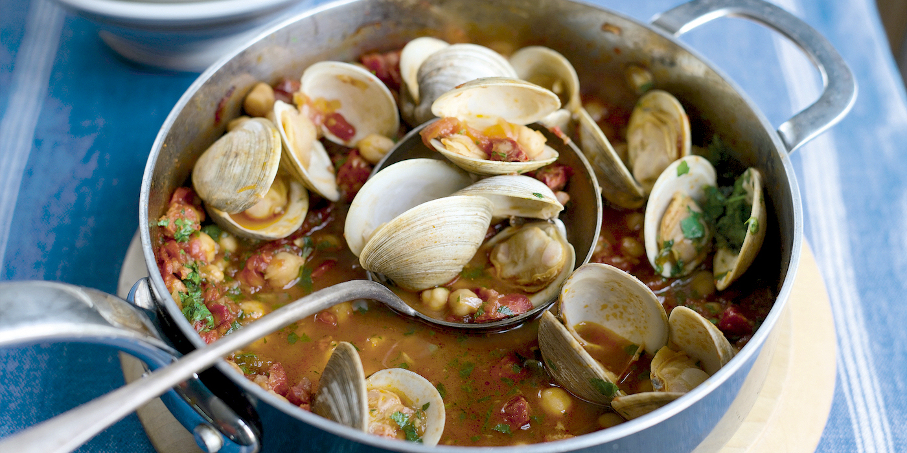

# Рагу с колбасками и ракушками по-португальски

#### Ингредиенты

на 4-6 порций 

* 1 столовая ложка оливкового масла
* 220 г сырой свиной чоризо
* 1 зубчик чеснока
* 400 г консервированных помидоров
* 1 чашка воды
* 1 столовая ложка рыбного соуса
* 1 банка нута
* морепродукты в раковинах (мидии или вонголе)
* пучок свежей петрушки

#### Приготовление

В кастрюле разогреть масло и выложить колбаски без оболочки, помешивать пока они не развалятся и не подрумянится. Добавить измельченный чеснок и готовить 1 минуту. Добавить помидоры, 1 чашку воды и рыбный соус, если используете, затем добавить нут. Довести до кипения, затем уменьшите огонь, накрыть крышкой и варить до легкого загустения, около 15 минут.

Добавить моллюсков и перемешать так, чтобы моллюски покрылись соусом; увеличить огонь до среднего. Накрыть кастрюлю крышкой и готовить, пока моллюски не раскроются, около 10 минут (выбросить все, что не раскрылось). Перед подачей добавить нарезанную петрушку.

*recipes.oregonlive.com*
