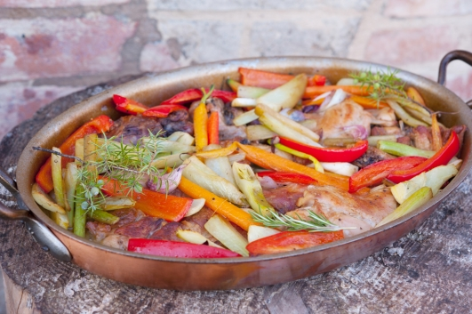

---
image: ../pics/rabbit-veges.jpg
---
# Кролик, запеченный в белом вине с овощами

#### Ингредиенты

* небольшой кролик, весом 1,2 кг
* 2 средних красных лука
* 1 средний фенхель
* 6 мелких морковок
* овощной бульон 500 мл
* белое сухое вино 100 мл
* оливковое масло холодного отжима
* 3 зубчика чеснока
* 2 веточки розмарина
* 2 веточки тимьяна
* свежемолотый белый перец
* соль

#### Приготовление

Нарезать кролика крупными кусками, помыть под холодной водой и обсушить. Овощи почистить и помыть, обсушить. Нарезать все овощи одинаковыми длинными и тонкими ломтиками.

Духовку разогреть до 220 С.

В сковороде разогреть масло, спассеровать очищенный зубок чеснока и листья розмарина и тимьяна. Выложить кролика в ароматизированное масло и обжарить небольшими порциями. Обжаренные кусочки мяса выложить в огнеупорную форму для запекания, посолить и поперчить.

Поставить форму (кастрюлю) на огонь, налить вино и довести до кипения. Тушить мясо на большом огне, пока алкоголь не испарится, периодически переворачивать. 

Влить в форму с мясом бульон, закрыть крышкой и поставить в духовку (середина). Запекать мясо в течение 40 минут, переворачивать мясо пару раз.

Снять крышку с формы и запекать еще примерно 15-20 минут, периодически переворачивая мясо. Готовое мясо должно отделяться от кости и быть золотистого цвета.

Пока мясо будет запекаться, приготовить овощи. В сковороде разогреть масло, спассеровать два зубчика чеснока и порциями обжарить овощи до золотистого цвета. Посолить и поперчить готовые овощи. В форму с готовым кроликом выложить овощи и поставить ее на 6-8 мин в духовку.

*ellamartino.com*
