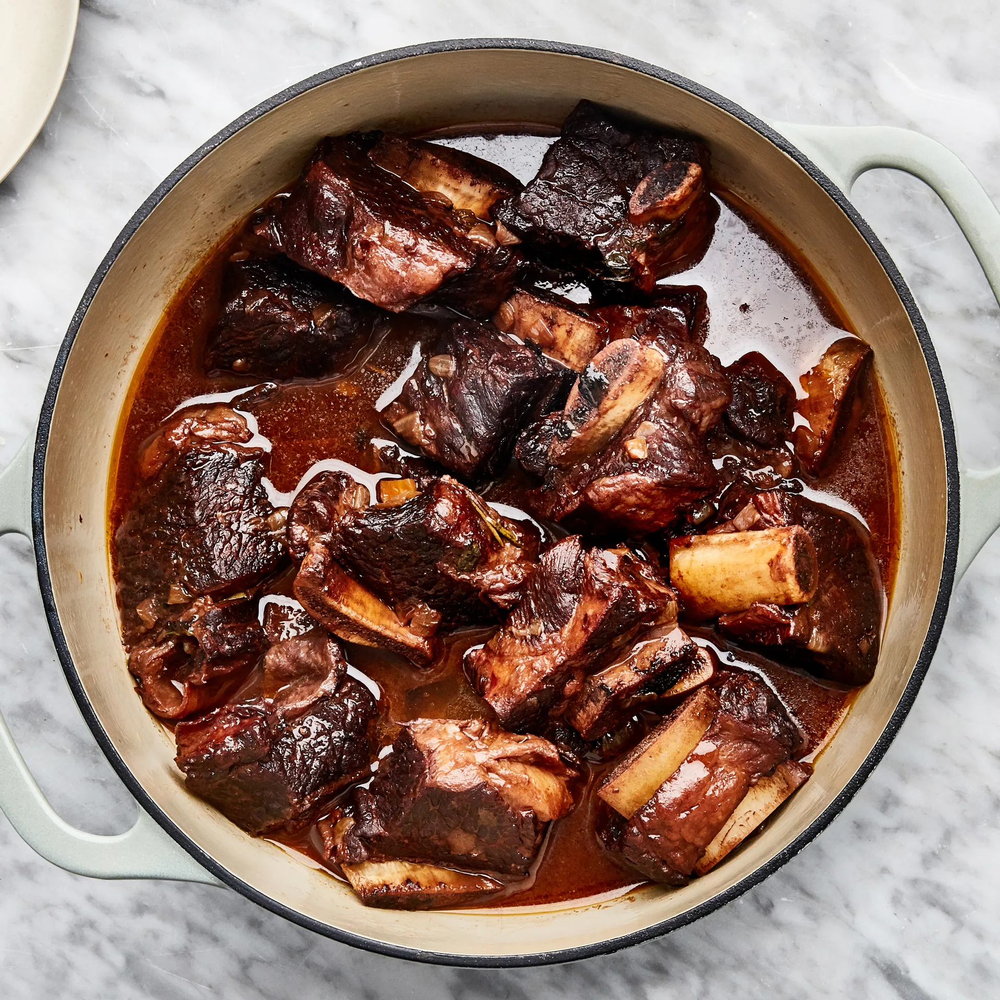

# Говяжьи ребрышки, тушеные в красном вине

#### Ингредиенты

6 порций

* 2,5 кг говяжьих ребрышек на кости
* 3 ст. л. растительного масла
* 3 средних желтых луковицы
* 3 средних моркови
* 2 стебля сельдерея
* 3 ст. л. муки
* 1 ст. л. томатной пасты
* 1 бутылка сухого красного вина объемом 750 мл (предпочтительно Каберне Совиньон)
* 10 веточек петрушки
* 8 веточек свежего тимьяна
* 4 веточки свежего орегано
* 2 веточки свежего розмарина
* 2 свежих или сушеных лавровых листа
* 1 головка чеснока, разрезанная поперек пополам
* 1 л. говяжьего бульона
* соль, свежемолотый черный перец

#### Приготовление

Нарезать кубиками лук и сельдерей, очистить и нарезать морковь.  
Обсушить ребра, приправить солью и перцем. В большой сковороде с высокими бортами разогреть масло на среднем или сильном огне до мерцания. Обжарить ребра с трех сторон, по 3–4 минуты с каждой стороны, не прожаривать полностью.

Переложить щипцами ребрышки в кастрюлю. Добавить бульон, тимьян, орегано, розмарин, лавровый лист вместе с чесноком.

Лук, морковь и сельдерей обжарить в сковороде, периодически помешивая, пока они не станут мягкими, около 5 минут. Добавит муку и томатную пасту, перемешать, чтобы покрыть овощи, и готовить около 2 минут. Влить вино и перемешайте, соскребая все подрумяненные кусочки. Довести до кипения, уменьшить огонь и варить на медленном огне, пока вино не выпарится наполовину, около 25 минут.

Вылить овощи с вином в кастрюлю, накрыть крышкой и готовить на медленном огне, пока мясо не станет мягким и не будет отходить от кости.  
Переложить ребрышки на большую тарелку с помощью щипцов. Некоторые ребрышки могут отделиться от кости. Процедить жидкость через мелкое сито и выбросить приготовленные овощи, травы и кости.

Подавать ребрышки с соусом, выложенным сверху, с полентой или картофельным пюре

_Bon Appétit_
