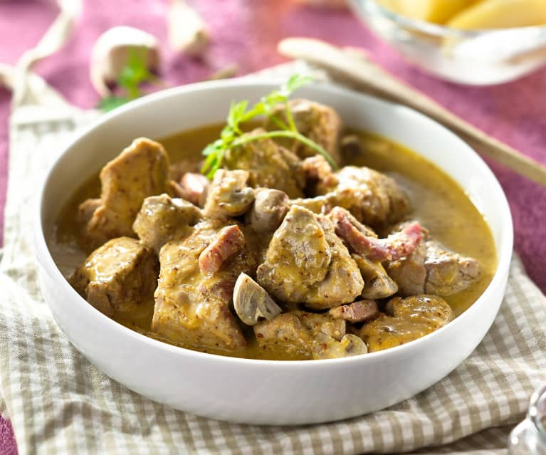

---
image: ../pics/saute-de-porc-aux-cidre.jpg
---
# Рагу из свинины в сидре | Sauté de porc au cidre

#### Ингредиенты

4 порции

* 700 г свинины (лопатка)
* 150 г бекона
35 г лука-шалота
60 г моркови, нарезанной кусочками
30 г оливкового масла
700 г свинины, нарезанной кубиками (3 см)
50 г цельнозерновой горчицы
100 г воды
1 кубик говяжьего бульона
3 щепотки соли, регулировать по вкусу
3 щепотки молотого перца, регулировать по вкусу
200 г сырого фермерского сидра
550 г картофеля, разрезанного вдоль на четвертинки
400 г свежих шампиньонов, разрезанных пополам или на четвертинки в зависимости от размера

#### Приготовление

Мясо нарезать кубиками по 3 см, обжарить на растительном масле до коричневой корочки.

Лук нарезать дольками, обжарить до мягкости.

Переложить щипцами ребрышки в кастрюлю. Добавить бульон, тимьян, орегано, розмарин, лавровый лист вместе с чесноком.

Лук, морковь и сельдерей обжарить в сковороде, периодически помешивая, пока они не станут мягкими, около 5 минут. Добавит муку и томатную пасту, перемешать, чтобы покрыть овощи, и готовить около 2 минут. Влить вино и перемешайте, соскребая все подрумяненные кусочки. Довести до кипения, уменьшить огонь и варить на медленном огне, пока вино не выпарится наполовину, около 25 минут.

Вылить овощи с вином в кастрюлю, накрыть крышкой и готовить на медленном огне, пока мясо не станет мягким и не будет отходить от кости.  
Переложить ребрышки на большую тарелку с помощью щипцов. Некоторые ребрышки могут отделиться от кости. Процедить жидкость через мелкое сито и выбросить приготовленные овощи, травы и кости.

Подавать ребрышки с соусом, выложенным сверху, с полентой или картофельным пюре

_Tiktok_
