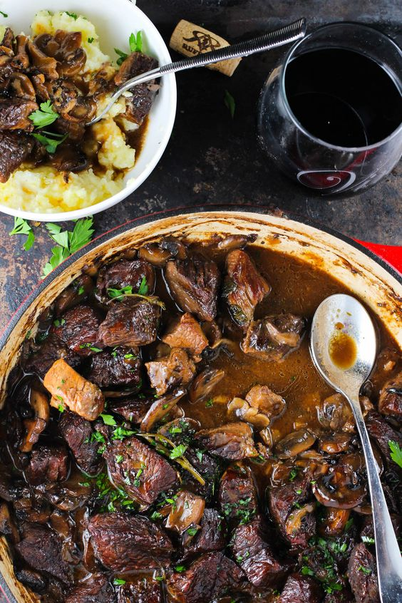

---
image: ../pics/e75d0885c6d4b269cbba44412527334f.jpg
---
# Тушёный свиной карбонад с опятами

#### Ингредиенты:

* Карбонад из свинины — 200 г
* Опята — 100 г
* Лук репчатый — 50 г
* Чеснок — 5 г
* Белое вино — 50 мл
* Вода — 200 мл
* Овощной бульон — 100 г
* Оливковое масло — 40 мл
* Петрушка — 20
* Мёд — 20 мл
* Соль, перец

#### Приготовление:

Помыть опята. После вскипятить воду и вылить туда вино. Затем бланшировать опята около трёх минут и посолить. Следующий шаг: разогреть сковородку с оливковым маслом, немного обжарить грибы — на это уйдёт около минуты.

Затем добавить репчатый лук, порезанным кольцами, кусочки карбонада и налить два вида бульона — всё это тушить около 30 минут. В конце посолить и поперчить. Можно подавать с брускеттами или с пастой.

[http://www.the-village.ru/village/food/chiefs/242953-mama-says-shrooms](http://www.the-village.ru/village/food/chiefs/242953-mama-says-shrooms)

