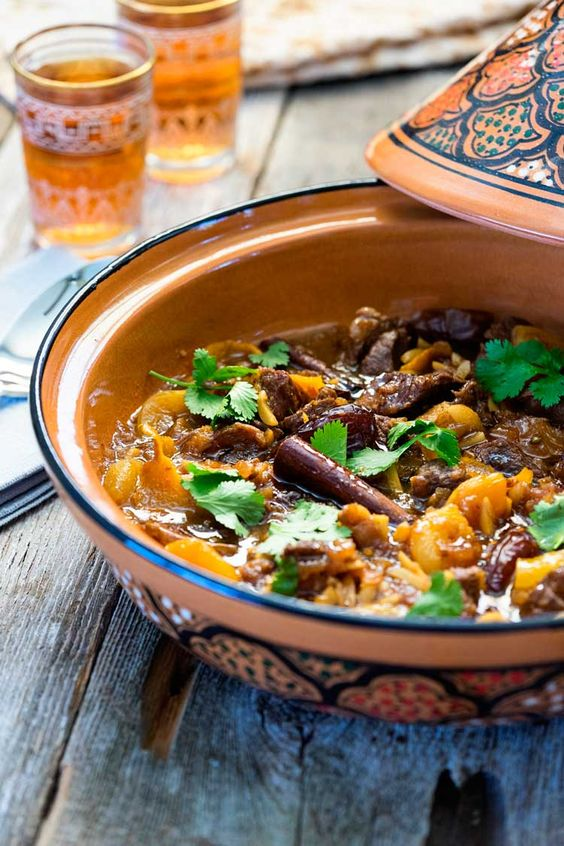

# Ягненок с финиками и курагой по-мароккански

#### Ингредиенты:

на 6 порций \| 2 часа

* 450 г ягнятины \(плечо или нога\),  нарезать небольшими кусочками
* 1 ст л оливкого масла + 1 ст л сливочного масла
* 2 ст л миндальных хлопьев
* 2 красных луковицы, мелко нарезать
* 3 зубчика чеснока, раздавить и мелко нарезать
* 2 ст л имбирной пасты
* щепотка шафрана
* 2 палочки корицы
* 2 ст л порошка кориандра
* 8 фиников без косточки
* 8 шт кураги или абрикосов
* 4 ленты цедры апельсина
* 2 ст л меда
* 1/2 ст л приправы Ras el Hanout \(опционально\) _использовала тандури масала_
* соль, перец

#### Приготовление:

Разогреть в тажине или сковороде с толстыми стенками оба вида масла. Обжарить миндаль до золотистого цвета на сильном огне. Добавить лук и чеснок, обжаривать на маленьком огне до золотистого цвета. Добавить имбирь, шафран, корицу и кориандр. Добавить ягнятину и обжаривать помешивая, так чтобы все мясо покрылось специями и луком, около 4 минут.

Влить воду так, чтобы она покрыла все мясо, и довести до кипения. Уменьшить огонь до минимума и тушить 1 час или до мягкости мяса.

Добавить финики, абрикосы и цедру апельсина. Тушить еще 20 минут.

Добавить мед и приправу ras-el-hanout и тушить еще 10 минут. Приправить солью и перцем по вкусу. Соус должен быть густым как сироп, если воды слишком много, потушить еще 5 минут до загустения.

Украсить мелко нарезанной кинзой и подавать с кускусом

[_https://keviniscooking.com/lamb-tagine-dates-apricots-honey/_](https://keviniscooking.com/lamb-tagine-dates-apricots-honey/)

