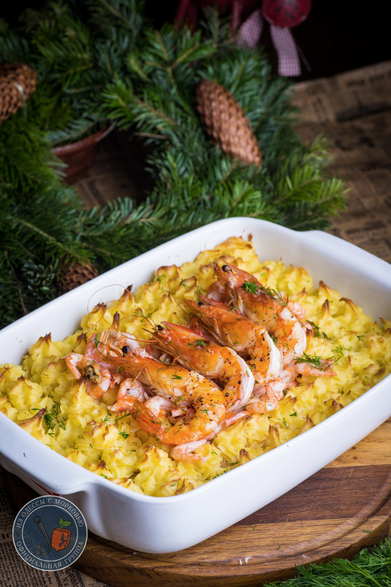

---
image: ../pics/c86b0bb33e63fe4740f87.jpg
---
# Fiskgratang  \| Рыбный гратен

#### Ингредиенты:

* Филе пикши, хека или другое белой рыбы - 700г
* немного муки для обжаривания
* 200г очищенных креветок
* 4-5 неочищенных креветок покрупнее
* укроп для украшения

**для пюре:**
* 700г крахмалистой картошки, для варки
* 50г сливочного масла
* 3ст.л. растительного масла
* 2 сырых желтка
* 1\4 ч.л. сладкой горчицы
* Соль и свежемолотый черный перец
  
**для соуса:**
* 100г спаржевой фасоли или спаржи
* 30г сливочного масла
* 2 ст.л. муки
* 100 мл белого сухого вина
* 300 мл рыбного бульона (насчет замен, как обычно, ниже)
* 100 мл жирных сливок. Но отлично работают и 15-20%
* соль и перец
* лимонный сок- мне хватило чуть меньше дольки
* 1 желток

#### Приготовление:

Разогреть духовку до 190С.

Очистить картошку и держать в холодной воде, чтобы потом не тратить время.

У спаржевой фасоли отрезать твердые кончики, закинуть в кипящую воду и бланшировать минуту. После чего переложить в миску с холодной, чтобы остыло. Откинуть на сито и дать стечь воде.

Рыбу очистить, отделить филе. Филе сполоснуть, промокнуть полотенцами и нарезать кусками среднего размера. В сковороде разогреть растительное масло, запанировать рыбу в муке и порционно жарить на среднем огне по 2-3 минуты до румяного цвета.

Пока жарится рыба, поставить вариться картошку. Ее можно разрезать пополам или на 4 части, в зависимости от размера. Довести до кипения, посолить и варить 18-22 минуты, до готовности,если картошка мягкая и крошится, готово.

Пока картошка варится, сделать соус. В сотейнике или кастрюле растопить сливочное масло, вмешать муку и хорошо мешать, чтобы мука полностью разошлась в масле, не оставив комков. Влить вино и, не переставая мешать, понемногу вливать бульон. Должен получиться однородный, густой соус средней плотности. Влить сливки, приправить солью и перцем, выдавить лимонную дольку. Вмешать сырой желток. Спаржевую фасоль нарезать некрупно и вмешать в соус.

Слить воду с картошки и размять в очень гладкое пюре, добавив все вышеуказанное: сливочное и растительное масло, желтки, горчицу и соль с перцем.

Крупные креветки очистить, убрать кишечную вену, слегка приправить солью и перцем и обжарить в хорошо разогретом масле по полминуты с каждой стороны.

В форму для запекания выложить рыбу, посолить и слегка приправить перцем, полить всем соусом. Теплое картофельное пюре выложить в кондитерский мешок с насадкой в виде «звездочки». Отсадить розочки по всему периметру формы, оставляя в центре место. Отправить форму в духовку на минут 10,чтобы верх немного подрумянился. Форму вынуть, в центр поместить очищенные креветки. На очищенные креветки уложить крупные, неочищенные. Отправить в духовку еще на пару-тройку минут или под гриль на те же 2-4 минуты. Уже на столе присыпать мелко нарезанным укропом

*https://telegra.ph/Rybnyj-graten-Fiskgratang-K-prazdniku-ili-na-kazhdyj-den-12-30*
