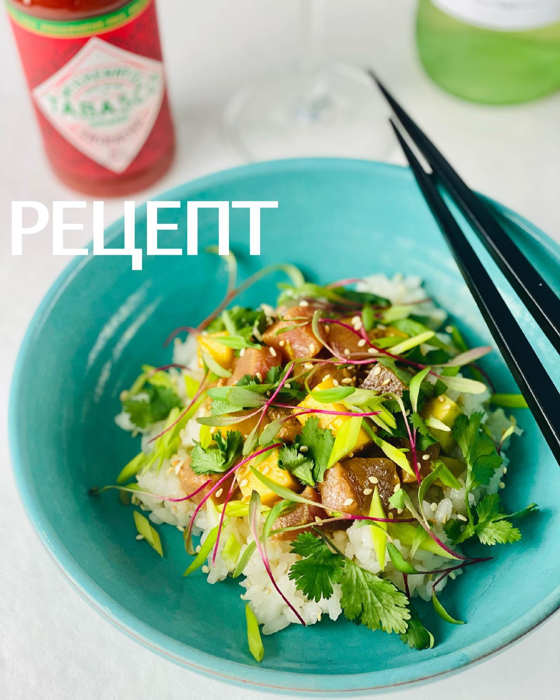

---
image: ../pics/chirashi.jpg
---
# Чираши с тунцом, авокадо и манго

#### Ингредиенты
на 2 порции

* рис для суши 150 г
* рисовый уксус 2 ст л
* сахар 1 ст л
* тунец свежий 150 г
* соевый соус 70 мл
* сок лайма 25 мл
* ширача 1 ч л
* 1 манго
* 1 авокадо
* кинза, кунжут

**Приготовление**:

Рис хорошо промыть, отварить [по рецепту](https://mars9n9.github.io/Tips/rice.html).  
Уксус с сахаром и щепоткой соли подогреть, чтобы сахар растворился.  
Рис переложить в тарелку, добавить уксус и хорошо перемешать в течение пары минут. Накрыть.  
Соевый соус смешать с лаймовым соком, ширачей и небольшим количеством растительного масла.  
Тунец, манго и авокадо нарезать кубиком, смешать с соусом.  
В миски выложить рис, сверху рыбную смесь, посыпать кунжутом и травами.  

_ig: foodedlife_
