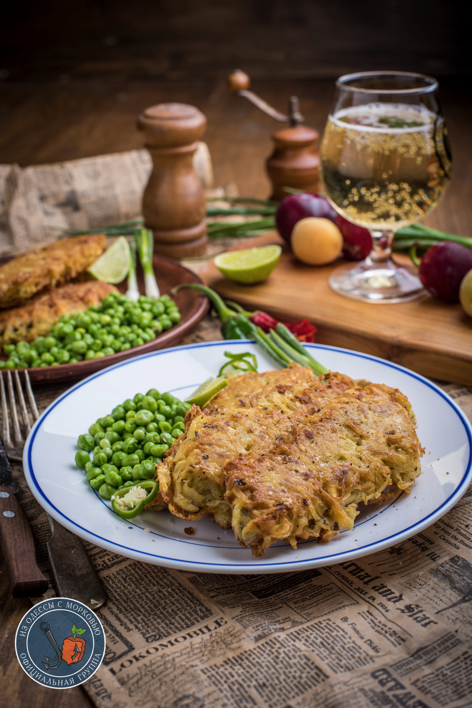

---
image: ../pics/fish-potato-crust.jpg
---
# Рыба в картофельной корочке

#### Ингредиенты

* рыбное филе потолще 8-10 штук
* картофель 7-8 штук
* мука 2 ст л  + для обваливания
* 2 яйца
* щепотка орегано, базилика или тимьяна
* пара долек лимона или лайма
* соль и черный перец

**Приготовление**:

Картофель очистить и натереть на крупной терке. Добавить лимон, чтобы меньше окислялось и темнело. Всыпать 2ст л муки. Добавить 2 яйца, соль и перец, орегано. Тщательно перемешать.

Влить в сковороду масло так, чтобы покрыло дно тонким слоем. Огонь установить выше среднего.

Рыбные филе промокнуть бумажными полотенцами и обвалять в муке. Каждое филе класть на руку и обложить картофелем, прижимая, с двух сторон. Готовить на огне «выше среднего» до золотистой корочки. Потом перевернуть и подрумянить вторую сторону. Затем огонь снизить до небольшого и готовить снова одну и вторую стороны еще 2-3 минуты. Время зависит от размера рыбы, огня, сковороды и количества масла.

Готовые рыбки складывать на решетку (чтобы нижняя часть рыбы не запаривалась от своей же температуры).

Подавать со сметанным соусом.

_tg: OdessaCarrot_
