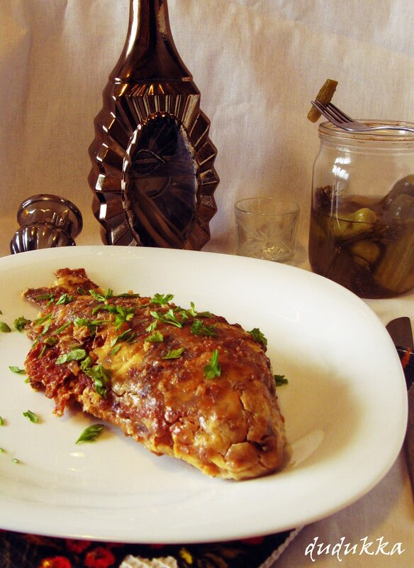

# Караси в сметане

#### Ингредиенты:

* 1 кг карасей 
* 1 луковица 
* 1 яйцо 
* 1 ст панировочных сухарей 
* 0,5 ст растительного масла для жарки без запаха 
* 2 ст жидкой сметаны
* 0,5 ч.л. соли 
* зелень укропа или петрушки для подачи

**Приготовление**:

Почистить рыбу . Хорошо промыть и обсушить полотенцем. 

Лук мелко порезать и пожарить 1 ст.л. масла. Смешать лук с яйцом и солью. 

Рыбу обвалять сначала в яичной смеси, затем в сухарях и обжарить с двух сторон на растительном масле. 

Разогреть духовку до 150 градусов. Выложить рыбу в форму для запекания, полить половиной сметаны и поставить в духовку. Когда рыба начнет немного запекаться, полить оставшейся сметаной и готовить дальше. Готовить примерно 1 час до золотистой корочки. 

Посыпать рубленной зеленью и подавать. 

[_https://world-cuisine.livejournal.com/113855.html_](https://world-cuisine.livejournal.com/113855.html)

