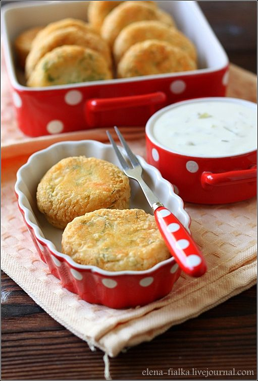

# Картофельные котлеты с лососем

**Ингредиенты:**

* 200г филе лосося
* 400г картофеля
* 50г сыра Гауда
* 1 небольшое яйцо
* 2 чайные ложки песто
* 1 столовая ложка порезанного укропа
* соль по вкусу
* растительное масло
* мука для панировки

**для соуса:** 

* 100мл сливок 22%
* 150г майонеза
* 1 крупный зубчик чеснока
* 2 маленьких соленых огурца
* перец

**Приготовление**:

Картофель очистить, порезать и отварить, сделать пюре. Добавить к картофелю тертый сыр, яйцо, укроп и песто. 

Филе лосося порезать небольшими кусочками и поджарить на растительном масле до готовности, размять немного вилкой, чтобы получились небольшие кусочки. Добавить к картофелю. Приправить солью, тщательно перемешать. 

Сформировать небольшие котлеты, панировать в муке и обжарить на растительном масле с двух сторон. 

Подавать с соусом.

\_\_[_http://elena-fialka.livejournal.com/146678.html_](http://elena-fialka.livejournal.com/146678.html)\_\_

