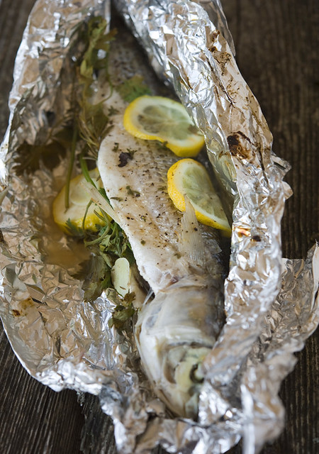

---
image: ../pics/5531136303_826b4f327d_z-1-.jpg
---
# Кефаль, запеченная в фольге \| Cefalo al cartoccio

#### Ингредиенты:

* 2 кефали весом примерно 800 г
* 4 зубчика чеснока
* 4 веточки петрушки 
* 2 веточки розмарина 
* 1,5 средних лимона 
* оливковое масло холодного отжима 
* свежемолотый черный перец 
* соль

**Приготовление**:

Зубчики чеснока произвольно порезать. У рыбы удалить жабры и кишки. Помыть кефаль в холодной воде.

Посолить и поперчить каждую рыбину. В брюшко каждой рыбе вложить по две веточки петрушкb, одной веточке розмарина и по два зубчика чеснока. Лимоны порезать, и вложить по два ломтика в брюшко каждой рыбе, и выложить два ломтика поверх рыбы.

Выложить каждую рыбину на фольгу, полить сверху оливковым маслом и обернуть плотно рыбу, чтобы не было дыр. Выложить рыбу на противень и запекать при температуре 200°С примерно 40 минут.

Подавать можно как в холодном, так и в горячем виде.

[_http://elladkin.livejournal.com/426698.html_](http://elladkin.livejournal.com/426698.html)

