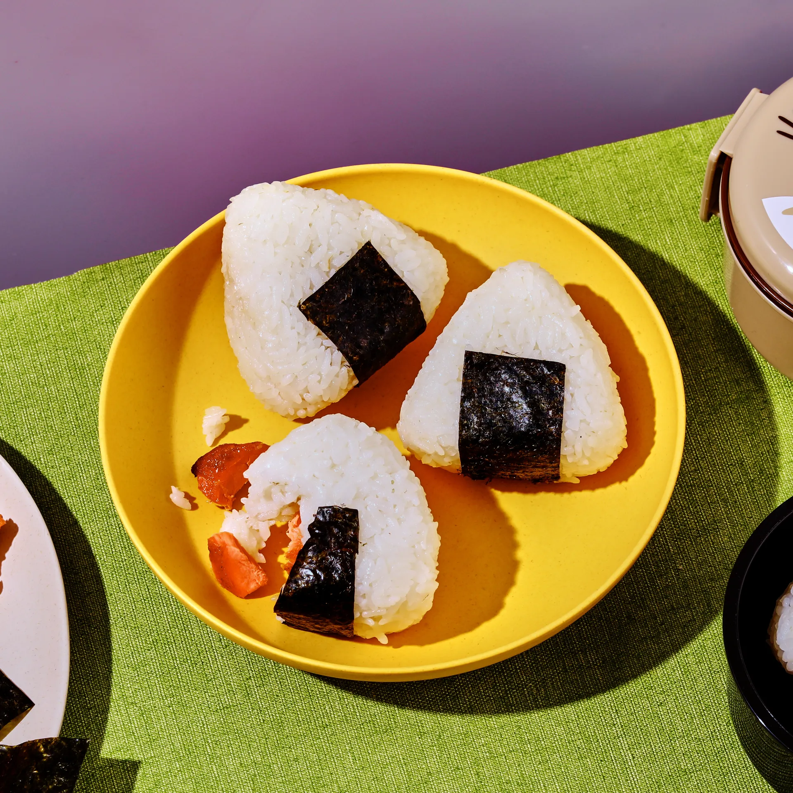

---
image: ../pics/onigiri.jpg
---
# Онигири

#### Ингредиенты

* рис для суши
* нори
  
* *кунжут*

**Приготовление**:

Рис хорошо промыть, отварить [по рецепту](https://mars9n9.github.io/Tips/rice.html). Смешать готовый рис с кунжутом, если используем.

Поджарить листы на сковороде с блестящей стороны. Разрезать листы нори, каждый лист на 3 части.

Поставить небольшую миску с водой на рабочую поверхность. Смочить руки водой перед тем, как брать рис, это предотвратит прилипание рисовых зерен к рукам.

Выложить в форму для онигири лист нори блестящей стороной наружу. Сформировать рисовые шарики, выложить рис на влажную ладонь, сделать небольшое углубление в центре риса, надавив большим пальцем, добавить начинку. Добавить около 1/2 столовой ложки начинки в центральное углубление и слегка надавить. Сформировать треугольники, слегка надавливая, чтобы рис держал форму. Обернуть онигири листом нори, как будто заворачиваетесь в одеяло.

# Okaka (おかか)

#### Ингредиенты
на 3 штуки

* хлопья бонито 6 г
* соевый соус 1 ст л

**Приготовление**:

В небольшой миске смешать сушеные хлопья тунца и соевый соус. Перемешать, пока хлопья тунца не впитают весь соевый соус.

# Грибы

#### Ингредиенты
на 9 штук

* сливочное масло 30 г
* грибы шимеджи 140 г
* грибы шиитаке 100 г
* грибы эноки 60 г
* соевый соус 1 ст л + 2 ч л
* саке или кулинарное вино 1 ст л
* кунжутное масло 1 ст л
* смесь 7 специй щепотка
* соль

**Приготовление**:

Растопить сливочное масло в антипригарной сковороде на среднем огне. Добавить все грибы, слегка приправить солью и тушить, иногда помешивая, до размягчения. Уменьшить огонь до средне-низкого. Добавить соевый соус, саке, масло и обжарить, добавить специи, остудить.

# Лосось терияки

#### Ингредиенты
на 8 штук

* филе лосося на коже 125 г
* крахмал 1 ст л
* соевый соус 1 ст л + 2 ч л
* коричневый сахар 1 ст л
* рисовый уксус 1 ст л
* саке или кулинарное вино 1 ст л
* растительное масло 1 ст л

**Приготовление**:

Рыбу протереть насухо, посолить с обеих сторон, обвалять в крахмале. В миске смешать соевый соус, сахар, уксус и саке.

В сковороде разогреть растительное масло. Обжарить рыбу кожей вниз до золотистости около 5 минут, перевернуть и слегка обжарить с другой стороны. Добавить немного саке, накрыть крышкой и тушить 3 минуты. Снять крышку и влить соус, потушить еще пару минут. Снять с огня, остудить.

Отделить лосось от кожи, разделить на волокна, добавить соус и смешать до однородности.

# Спайси лосось, огурец, авокадо

#### Ингредиенты

* малосольное филе лосося
* шрирача
* майонез
* авокадо
* огурец 

**Приготовление**:

Рыбу смешать с соусами. Авокадо и огурец нарезать кубиками. Выкладывать начинку не перемешивая предварительно.

# Лосось, огурец, кримчиз

#### Ингредиенты

* малосольное филе лосося
* огурец
* кримчиз

**Приготовление**:

Рыбу и огурец нарезать ломтиками. Выкладывать начинку не перемешивая предварительно.

# Спайси тунец

#### Ингредиенты

* тунец консерва
* шрирача
* майонез

# Яки-онигири

**Приготовление**:

Разогреть сковороду на среднем огне, добавить немного растительного масла. Обжарить с обоих сторон до золотистости, 3-4 минуты.  
Опустить огонь до низкого, кисточкой смазать онигири соевым соусом, перевернуть и обжарить еще примерно 30 сек с каждой стороны.
