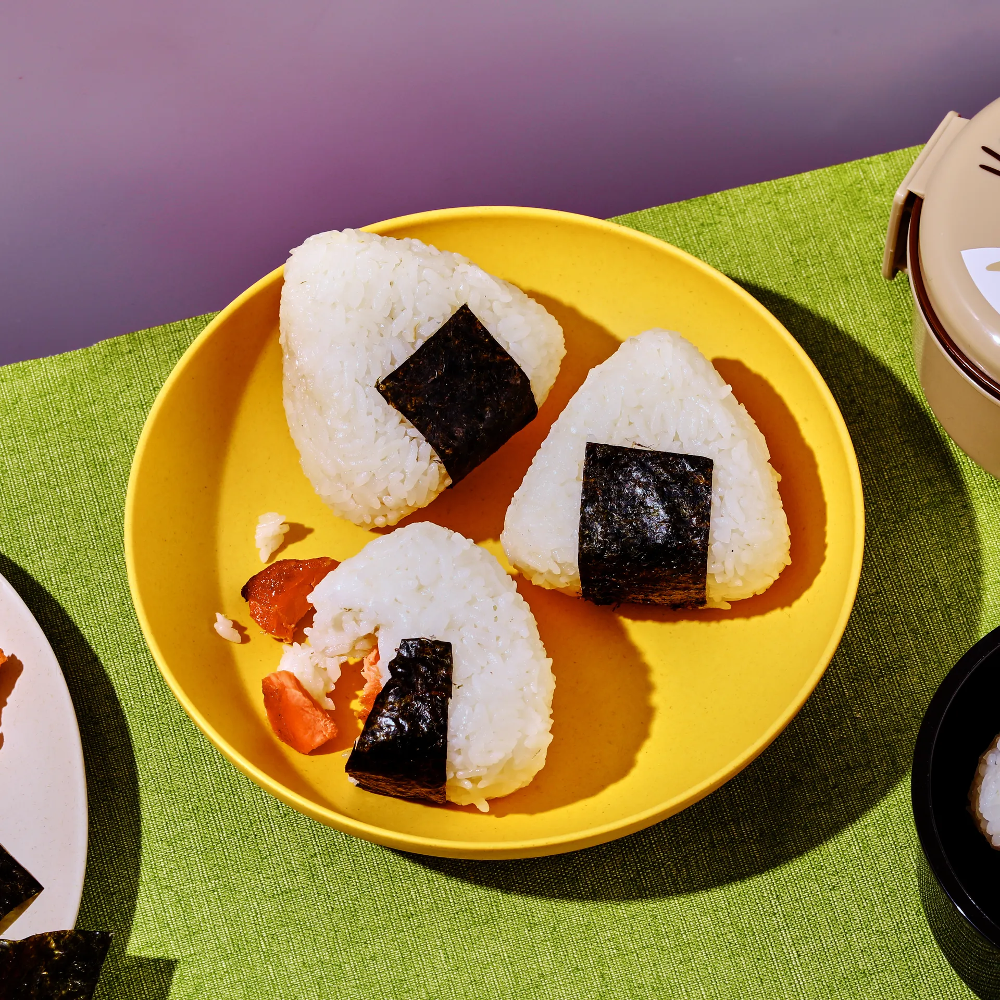

# Онигири

#### Ингредиенты

* рис для суши
* нори
  
* *кунжут*

**Приготовление**:

Рис хорошо промыть, отварить [по рецепту](https://mars9n9.github.io/Tips/rice.html) без соли, не заправлять. Использовать для лепки горячий рис сразу. Смешать готовый рис с кунжутом, если используем.

Поджарить листы на сковороде с блестящей стороны или использовать готовые Yaki Nori. Разрезать листы нори пополам.

Поставить небольшую миску с водой на рабочую поверхность. Смочить руки водой перед тем, как брать рис, это предотвратит прилипание рисовых зерен к рукам. На влажные руки насыпать щепотку крупной морской соли (примерно 0.5–1 г на один онигири) и растереть. Соль остается на внешней оболочке. Она выполняет роль консерванта (онигири исторически берется с собой в дорогу) и дает яркий контрастный вкус при первом укусе, оставляя середину пресной.

Сформировать рисовые шарики, выложить рис на влажную ладонь, сделать небольшое углубление в центре риса, надавив большим пальцем. Добавить около 1 чайной ложки начинки (примерно 10–15 г) в центральное углубление и слегка надавить.  Начинка не должна доходить до краев. Сформировать треугольники, слегка надавливая, чтобы рис держал форму. Обернуть остывшие онигири листом нори, как будто заворачиваетесь в одеяло.

# Окака (おかか) — Стружка тунца с соевым соусом

#### Ингредиенты
на 3 штуки

* хлопья бонито 6 г
* соевый соус 
* сахар

**Приготовление**:

В небольшой миске смешать сушеные хлопья тунца, несколько капель соевого соуса и щепотку сахара до увлажнения. Перемешать, стружка должна быть слегка влажной, но соус не должен стекать на дно.

# Тарако / Ментайко (たらこ / 明太子) — Икра минтая

**Приготовление**:

Тарако (соленая) или ментайко (острая с перцем) может использоваться сырой или слегка обжаренной. Для онигири икру либо подпекают на сухой сковороде прямо в ястыке (пленке) до изменения цвета, либо снимают пленку и выкладывают сырую икру внутрь.

# Умэбоси (梅干し) — Маринованная слива

**Приготовление**:

Из сливы вынуть косточку. Крупную сливу слегка размять вилкой или нарезать кусочками

# Грибы

#### Ингредиенты
на 9 штук

* грибы шимеджи 140 г
* грибы шиитаке 100 г
* грибы эноки 60 г
* сливочное масло 30 г
* соевый соус 1 ст л
* смесь 7 специй щепотка
* соль

**Приготовление**:

Грибы мелко нарезать и обжарить на сухой сковороде, пока не выпарится вода. Добавить сливочное масло, соевый соус, специи, обжарить до полного высыхания соуса.

# Лосось терияки

#### Ингредиенты
на 8 штук

* филе лосося на коже 125 г
* крахмал 1 ст л
* саке или кулинарное вино 1 ст л
* соус терияки 2 ст л

**Приготовление**:

Рыбу протереть насухо, посолить с обеих сторон, обвалять в крахмале. В миске смешать соевый соус, сахар, уксус и саке.

В сковороде разогреть растительное масло. Обжарить рыбу кожей вниз до золотистости около 5 минут, перевернуть и слегка обжарить с другой стороны. Добавить немного саке, накрыть крышкой и тушить 3 минуты. Снять крышку и влить соус, потушить еще пару минут. Снять с огня, остудить.

Отделить лосось от кожи, разделить на волокна и смешать до однородности. Если есть излишки соуса, убрать их.

# Спайси лосось, огурец, авокадо

#### Ингредиенты

* малосольное или замеченое филе лосося
* шрирача
* майонез
* авокадо
* огурец 

**Приготовление**:

Рыбу смешать с соусами. Авокадо нарезать кубиками. Огурец очистить от семян и нарезать мелкой соломкой, посыпать солью, через 5 минут отжать. Выкладывать начинку не перемешивая предварительно.

# Лосось + Сливочный сыр + Икра (鮭クリチ明太 — Sake Kuri-chi Mentai)

#### Ингредиенты

* запеченный лосось
* кримчиз
* икра минтая, немного острая

**Приготовление**:

Рыбу и огурец нарезать ломтиками. Выкладывать начинку не перемешивая предварительно.

# Тунец с майонезом (ツナマヨ — Цунамаё)

#### Ингредиенты

* тунец консерва, отжать от влаги
* японский майонез
* капелька соевого соуса
* черный перец

# Яки-онигири

**Приготовление**:

Разогреть сковороду на среднем огне, добавить немного растительного масла. Обжарить с обоих сторон до золотистости, 3-4 минуты.  
Опустить огонь до низкого, кисточкой смазать онигири соевым соусом, перевернуть и обжарить еще примерно 30 сек с каждой стороны.
