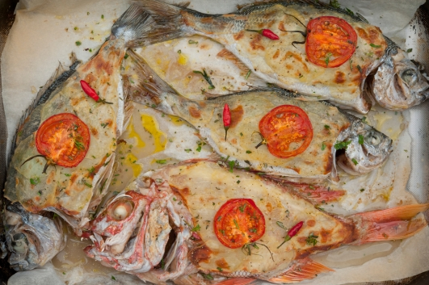

# Рыба в картофельной корочке с ароматными травами \| Pesce in crosta di patate con erbe aromatiche

#### Ингредиенты:

на 4 порции

* 4 рыбы весом 350 г каждая \(зубан, облада, дорада и тд\)
* 1 средний картофель
* 2 ломтика лимона
* 1 зубок чеснока
* 1 средний помидор
* 1 веточка розмарина
* 2 веточки петрушки
* 1 веточка базилика
* 4 маленьких красных острых перца
* оливковое масло холодного отжима
* свежемолотый белый перец
* соль

**Приготовление**:

Разогреть духовку до 230 С, выстелить противень бумагой для выпечки.

Рыбу очистить от внутренностей, удалить жабры и чешую, помыть, обсушить и выложить на противень.

Картофель очистить от кожуры и очень тонко натереть на мандолине. Выложить картофель сверху каждой рыбы тонким слоем. В брюхо каждой рыбы вложить по 1/4 зубчика чеснока и 1/2 ломтика лимона. Помидор тонко назезать, выложить ломтики помидоры сверху картофеля. Посолить рыбу, поперчить, полить оливковым маслом и поставить в духовку на 15 минут.

Через 15 минут включить функцию гриль в духовке и запечь рыбу до светло-золотистого цвета.

Готовую рыбу достать из духовки, посыпать сверху мелко нарезанными ароматными травамии острым перцем.

[_http://www.ellamartino.ru/ru/recipes/ryba-v-kartofelnoy-korochke-s-aromatnymi-travami-pesce-crosta-di-patate-con-erbe-aromatiche_](http://www.ellamartino.ru/ru/recipes/ryba-v-kartofelnoy-korochke-s-aromatnymi-travami-pesce-crosta-di-patate-con-erbe-aromatiche)  

