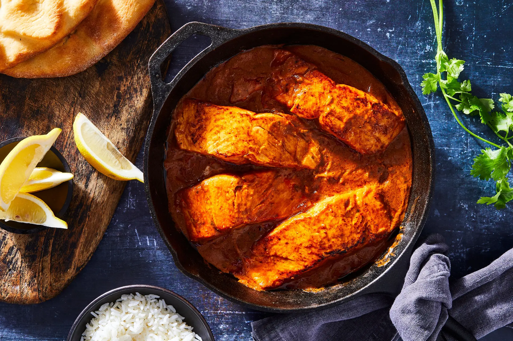

---
image: ../pics/salmon-tikka-masala.webp
---
# Лосось тикка-масала

#### Ингредиенты
* стейк лосося 4 шт
  
**для маринада:**
* йогурт 3 ст л
* молотый чили ¼ ч л
* молотая куркума ¼ ч л
* молотый фенхель ½ ч л
* молотая зира ½ ч л
* молотый кориандр ¼ ч л
* соль ½ ч л
* горчичное масло 2 ст л

**для масалы:**
* сливочное масло 50 г
* сухие травы
* молотый сухой чеснок
* растительное масло 1 ст
* свежий имбирь
* пряности1: семена зиры ¼ ч л, семена фенхеля ¼ ч л, палочка корицы ¼ ч л, 4 зеленых кардамона, 4 гвоздики
* сухой пажитник 1 ч л
* пряности2: молотая куркума ¼ ч л, молотая зира ½ ч л, молотый чили ¼ ч л, молотая корица ½ ч л
* пассата 250 г
* вода 200 мл
* сахар 1 ч л
* гарам-масала ½ ч л
* сливки 20% 110 г
* кинза для украшения

#### Приготовление

В большой тарелке смешать ингредиенты маринада до однородной пасты. Замариновать лосось и оставить в холодильнике на 15 минут.

В это время приготовить масалу. В сковороде растопить сливочное и растительное масла с травами и чесноком. Добавить тертый имбирь и пряности1, прогреть несколько секунд, добавить пажитник, приправить солью и готовить 1 минуту. 

Смешать воду с пассатой, добавить пряности2 и сахар, вылить в сковороду и дать покипеть 15 минут.

Обжарить маринованный лосось на гриле или на сковороде с небольшим количеством масла по 2 минуты с каждой стороны.

В готовую масалу добавить гарам-масалу и сливки, перемешать. Выложить слоями жареный лосось и дать ему покипеть в масале 5 минут.

Подавать с рисом, украсив нарезанной кинзой.