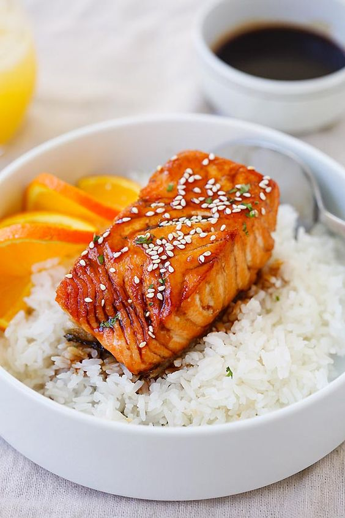

---
image: ../pics/e721c66192bc6e79a84d1f0f66b7d87f-1.jpg
---
# Лосось в апельсиновой глазури терияки

#### Ингредиенты:

2 порции \| 10 минут

* 450 г филе лосося
* щепотка соли 
* молотый черный перец 
* 1 чайная ложка масла для жарки

**для гарнира:**

* ломтики апельсина
* семена кунжута

**для соуса:**

* 100 мл сакэ или китайского рисового вина
* 2 столовые ложки соевого соуса 
* 3 столовые ложки апельсинового сока 
* 1 столовая ложка сахара 
* 1 чайная ложка кукурузного крахмала 

#### Приготовление:

Обмазать лосось солью и черным перцем.

Смешайте все ингредиенты для соуса терияки в сотейнике. Нагревать на медленном огне, пока соус не загустеет.

Разогреть сковороду с маслом на среднем огне. Обжарить лосось до готовности, около 4-5 минут с каждой стороны, в зависимости от толщины лосося.

Подавать лосось с соусом терияки, посыпанным кунжутом и с долькой апельсина

[_http://rasamalaysia.com/salmon-with-orange-teriyaki-glaze/2_](http://rasamalaysia.com/salmon-with-orange-teriyaki-glaze/2/)

