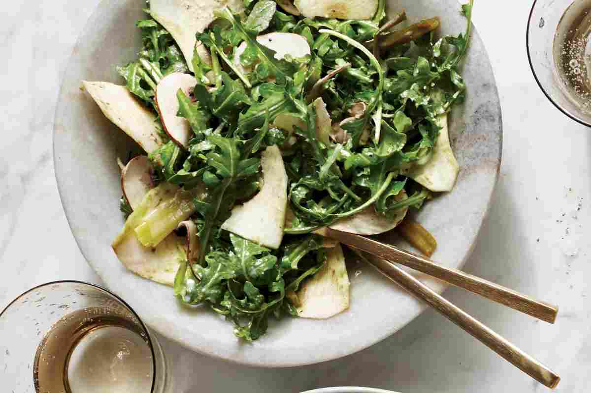

---
image: ../pics/artichoke-herb-salad.jpg
---
# Салат с артишоком

###### Ингредиенты

* 3 больших артишока
* лимонный сок 3 ст л
* оливковое масло 4 ст л
* руккола 40 г
* мята 15 г
* кинза 15 г
* сыр пекорино 30 г
* соль, черный перец

#### Приготовление

Подготовить миску с водой, смешанной с половиной лимонного сока.

Удалить стебли артишоков и снять жесткие внешние листья. Используя большой острый нож, разрезать цветок поперек так, чтобы осталась нижняя четверть. Используя небольшой острый нож, удалить внешние слои артишока, пока не обнажится основание (или дно). Выскоблить волоски и поместить основание в подкисленную воду. Выбросить остальное. Поместить в воду и оставить на несколько часов при комнатной температуре.

Слить воду с артишоков и промокнуть их бумажными полотенцами. Используя мандолину или большой острый нож, нарезать артишоки на тонкие, как бумага, ломтики и переложить в большую миску. Выдавить сверху оставшийся лимонный сок, добавить оливковое масло и хорошо перемешать, чтобы покрыть их.

Подавать, добавив к артишокам рукколу, мяту и кинзу и щедро приправив солью и перцем. Аккуратно перемешать и разложить по сервировочным тарелкам. Украсить стружкой пекорино.

*Yotam Ottolenghi, "Jerusalem"*
