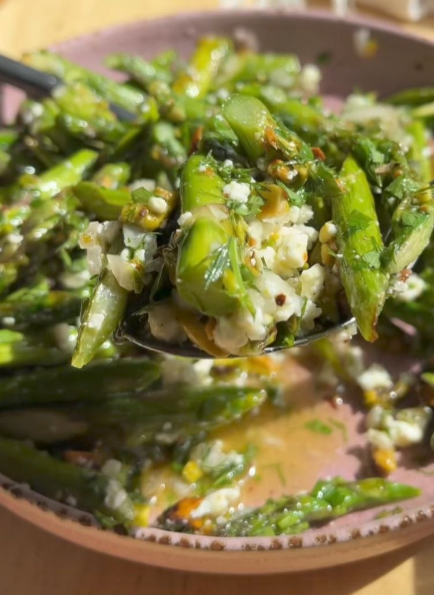

---
image: ../pics/asparagus-feta-pistachio.jpg
---
# Теплый салат из спаржи с фетой и фисташками

#### Ингредиенты

* спаржа
* фета
* фисташки
* петрушка
* оливковое масло
* лимонный сок
* заатар

#### Приготовление

Спаржу нарезать на небольшие кусочки, мелко нарезать петрушку, фисташки нарубить. быстро обжарить на оливковом масле, посолить. Для соуса смешать лимонный сок, оливковое масло и заатар. К спарже добавить петрушку, фисташки, раскрошенную фету, полить заправкой

*tiktok: dishingouthealth*