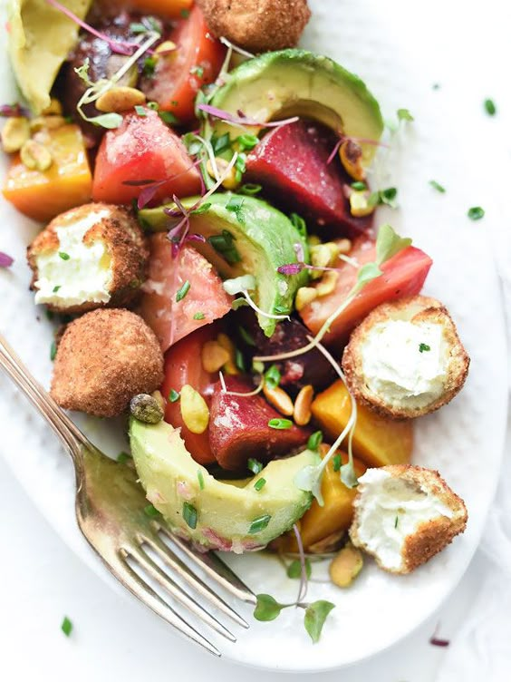

---
image: ../pics/beetroot-avocado.jpg
---
# Салат с авокадо, свеклой и обжаренным козьим сыром

#### Ингредиенты

* маленькие свеклы 8-10 шт
* авокадо 1 шт
* фисташки 30 г
* зелень для украшения
* оливковое масла
* бальзамический уксус 2 ст л
* сахар 1 ч л
* соль, перец

**для обжаренного сыра:**

* козий сыр 170 г
* 1 яйцо
* мука 60 г
* сухари панко 60 г
* растительное масло для фритюра

#### Приготовление

Разогреть духовку до 190 градусов. Вымытую свеклу сбрызнуть растительным маслом и посолить, завернуть в фольгу. Запекать около 1 часа до мягкости. Вынуть и остудить. Остуженную свеклу очистить и нарезать

Смешать оливковое масло, уксус и сахар, добавить 2/3 заправки к свекле и оставить мариноваться

Сыр разогреть до комнатной температуры, сформировать небольшие шарики из, приготовить миски с мукой, яйцом и панировкой. Обвалять сыр в муке, яйце и панировке, повторить еще раз для хрустящести, отложить. Повторить для всех сырных шариков.

Разогреть в кастрюле масло до 180 градусов. Окунать шарики по 3-4 штуки примерно на 2 минуты до золотистости. Обсушить на бумажных полотенцах.

Выложить в салатник маринованную свеклу, нарезанный авокадо, сырные шарики, добавить оставшуюся заправку, посолить и поперчить по вкусу, украсить зеленью и нарубленными фисташками.

_foodiecrush.com_
