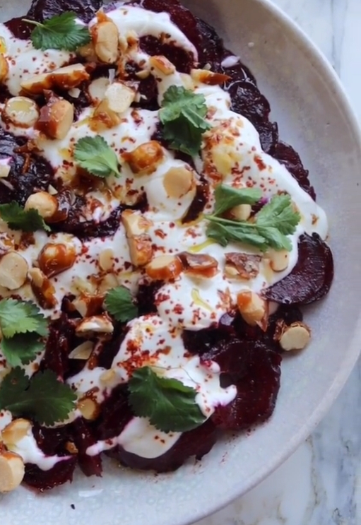

---
image: ../pics/beet-salad.jpg
---
# Салат из запеченной свеклы

#### Ингредиенты

* свекла
* оливковое масло
* кленовый сироп
* сахар
* лесные орехи или макадамия
* греческий йогурт
* хлопья чили
* кинза

#### Приготовление

Свеклу запечь в фольге в духовке при 180С, очистить, нарезать кружочками.  
Смешать с оливковым маслом, кленовым сиропом, добавить соль.

Расплавить сахар на сковороде до карамелизации, добавить лесные орехи, перемешать с карамелью, выложить на пергамент и остудить. Нарезать остывшие орехи на крупные кусочки.

Собрать салат: выложить на тарелку свеклу, полить греческим йогуртов, добавить орехи, щепотку чили перца, нарезанную кинзу.

*Ottolenghi*
