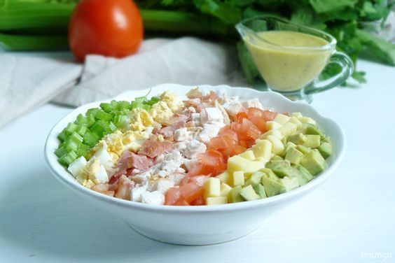

---
image: ../pics/cobb.jpg
---
# Кобб салат

Название салат получил в честь своего автора - Боба Кобба, владельца ресторана Дерби Браун. Как-то ночью Боб зашел на кухню ресторана, чтобы чем-нибудь перекусить. Блуждая от холодильника к холодильнику, он нашел небольшой кусочек сыра, пару отварных яиц, помидор, чеснок, авокадо, вареную куриную грудку, сельдерей, несколько листиков салата. А повар в это время жарил бекон, и Кобб решил взять у него пару ломтиков. Из этого нехитрого набора он на скорую руку приготовил салат с классической заправкой. Но вкус готового блюда настолько ему понравился, что вскоре Кобб салат был включен в меню заведения.

Сегодня Кобб салат готовят и с отварной, и с запеченой, и с жареной грудкой. Сыр используют либо чеддер, либо с голубой плесенью типа Дор Блю. Также варьируется наличие сельдерея в составе и вид заправки.

#### Ингредиенты

на 2 порции

* горсть салатных листьев \(романо или латук\)
* 1 отварная или запеченная куриная грудка
* 2 крутых яйца
* 2 небольших помидора
* 1 авокадо
* сыр чеддер
* бекон 4 полоски

**для соуса:**
* горчица с зернами 1 ч л
* дижонская горчица 1 ч л
* сухой чеснок
* белый винный уксус 2 ст л
* оливковое масло 4 ст л

#### Приготовление

Чеснок пропустить через пресс.

Смешать измельченный чеснок с двумя видами горчицы, уксусом и маслом.

Бекон обжарить на раскаленной сковороде пока он не станет немного хрустящим.

Все ингредиенты для салата \(кроме салатных листьев\) нарезать небольшими кубиками или короткими полосками.

В тарелку выкложить салатные листья.

Сверху полосками выкложить остальные ингредиенты.

Заправка подается отдельно.
