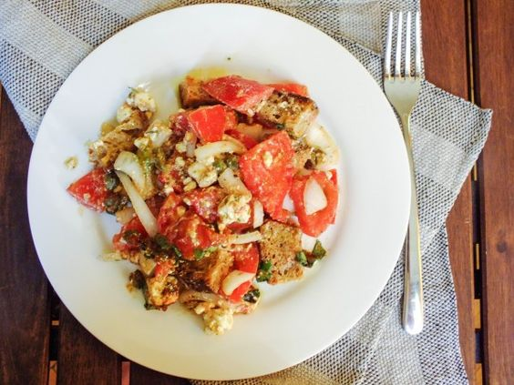

---
image: ../pics/53aee8c0e0d588ee0ebadfcec4f45219-1.jpg
---
# Греческий салат

Греческий салат - это просто дань и уважение туристам. Его готовят на каждом шагу в Греции, и каждый считает, что он попробовал "настоящий" греческий салат.

На деле же все абсолютно не так. Греки готовят салат из тех ингредиентов, которые доступны по сезону и широко распространены в их регионе: прямо здесь и сейчас. Обычно в греческих деревнях основу настоящего греческого салата составляют очень спелые, мясистые и ароматные томаты, сорванные прямо с огорода, лук, доступные на тот момент зеленые овощи \(огурцы, сладкий или острый перец\) и салатные листья, типа ромейна, рукколы и так далее. Сверху салат посыпается крошками сыра Фета. Иногда салат дополняется каперсами и оливками.

Заправка очень проста, но в то же самое время, очень ароматна: оливковое масло и сухой орегано. Подаваться такой салат может с соленой рыбой, типа сардин или анчоусов, либо с греческим хлебом Паксимадия.

Паксимадия \(ячменные сухарики\) - это греческий специалитет, история которых уходит глубоко в века. Он был популярен на протяжении долгих веков среди островитян и купцов, так как пшеница в тех регионах росла плохо, а привычный для нас хлеб из пшеницы не был доступен. Такой хлеб пекут дважды - от этого хлеб приобретает очень твердую структуру, и чтобы его размягчить, греки его вымачивают в воде либо за счет сока, который отдают все ингредиенты при настаивании.

#### Ингредиенты

3 - 4 порции \| 1 час 15 мин

* 5 больших горстей ячменных сухариков
* 1 кг спелых и сочных томатов, которые не хранились в холодильнике
* 1 белая луковица большого размера
* 3-4 ст.л. каперсов
* большой пучок зеленого базилика \(можно заменить на петрушку в комбинации со свежим орегано или тимьяном\)
* 300-400 гр сыра фета
* 1 ст.л. сухого орегано
* 2 ст.л. бальзамического уксуса
* 100 мл оливкового масла
* 2-3 перца чили \(по вкусу\)
* цедра 1 лимона
* соль и свежемолотый черный перец по вкусу

#### Приготовление

В глубокую миску выложить кусочки хлеба или сухариков.

Острым \(желательно, с «волнистым» лезвием\) ножом нарезать большими ломтиками томаты. Распределить их в миске следующим слоем после хлеба, дав таким образом всему соку концентрироваться в хлебе и размягчать его.

Лук нарезать кольцами и так же распределить следующим слоем после томатов. Салатные листья выложить на луковые кольца.

Присыпать лук порубленными листьями базилика \(иди других пряных трав\) и каперсами.

Затем раскрошить сыр фета и приправьть его сухим орегано.

Для заправки смешайть оливковое масло и бальзамический уксус. Добавить измельченный перец чили \(без семян\) и цедру лимона, приправить солью и перцем по вкусу.

Полученной заправкой равномерно полить салат.

Миску накрыть кухонным полотенцем и дать салату настояться около часа в прохладном месте.

Перед подачей аккуратно перемешайть все ингредиенты.

[_http://kitchen-fast.livejournal.com/353982.html_](http://kitchen-fast.livejournal.com/353982.html)

