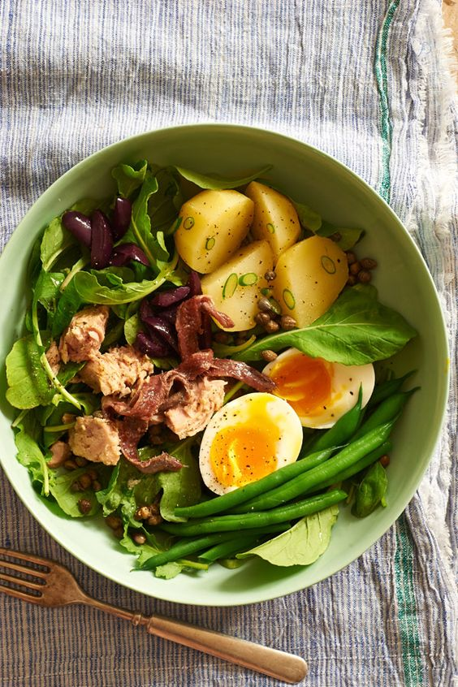

# Салат Нисуаз

#### Ингредиенты:

на 2 порции

* Тунец или лосось 200 г
* Консервированный тунец 50 г
* Молодой картофель 4 штук
* Зеленая фасоль или спаржа 60 г
* Перепелиное яйцо 4 штуки
* Маринованные мини-артишоки 160 г
* Огурцы 100 г
* Помидоры 100 г
* Вяленые помидоры 20 г
* Маслины 20 г
* Редис 20 г
* Смесь салатных листьев 40 г
* Мед 40 г
* Домашний майонез
* Бальзамический уксус 100 мл
* Соевый соус 20 мл
* Базилик
* Тимьян
* Чеснок 2 зубчика
* Молотый черный перец
* Соль

**Приготовление**:

Приготовить домашний майонез, смешать с консервированным тунцом, пробить блендером.

Для дрессинга выпарить в четыре раза бальзамический уксус, добавить мед и 3–4 ложки оливкового масла, перемешать.

На ложке оливкового масла обжарить рыбу до золотистости. Нарезать не очень толстыми кусками.

Бланшировать фасоль или спаржу в кипящей воде, залить ледяной водой и откинуть на дуршлаг.

По дну тарелок размазать майонезно-тунцовую смесь. Разложить по всей поверхности салатный микс, нарезанные крупно овощи, яйца, маслины, базилик и нарезанный тонкими кружками редис.

В самом конце выложить обжаренную рыбу, сбрызнуть оливковым маслом и соевым соусом, украсить листьями сельдерея и кресс-салатом и полить медово-бальзамическим дрессингом.

[_https://eda.ru/_](https://eda.ru/)

