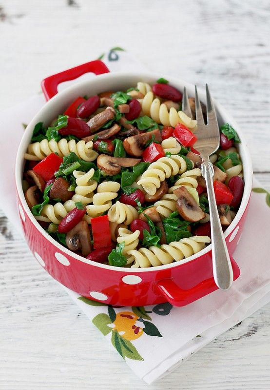

# Салат с пастой, шпинатом, грибами и фасолью

#### Ингредиенты
на 4 порции

* Фузилли 200 гр
* 1 сладкий красный перец
* 200 гр листья шпината
* 200 гр коричневые шампиньоны
* 1 банка консервированной красной фасоли 250 гр
* 1 пучок зеленого лука
* 1.5 ст.л оливковое масло

**для заправки:**

* Чеснок 2 зубчика\(пресс\)
* 1 ст.л яблочный уксус 6%
* 3-4 ст.л лимонный сок
* Масло грецкого ореха или оливковое 2 ст.л
* Молотая зира ½ ч.л
* Молотый мускатный орех ¼ ч.л
* Молотый кориандр ½ ч.л
* Карри ¼ ч.л
* Черный молотый перец по вкусу
* Кайенский перец по вкусу
* Соль по вкусу
* 2 ст.л нарезанного базилика

## Приготовление

Отварить фузилли или любую другую пасту в подсоленной воде. Промыть холодной водой и откинуть на сито. Переложить в салатницу.  
Нарезать зеленый лук, грибы, шпинат и сладкий перец. На 1,5 ст.л оливкового масла обжарить лук, сладкий перец на среднем огне около 1-2 минут. Добавить шпинат и готовить 1 минуту. На отдельной сковороде на 1 ч.л оливкового масла обжарить грибы, до испарения жидкости.  
Слить жидкость из банки с фасолью, фасоль промыть, обсушить. Соединить все ингредиенты, добавить фузилли. Добавить заправку.  

*elena-fialka.livejournal.com*
