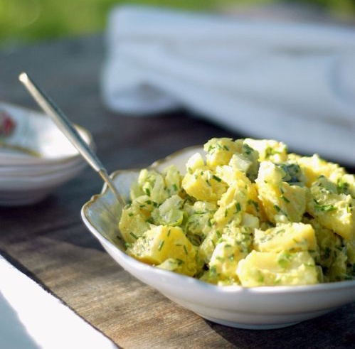

---
image: ../pics/potato-lemon.jpg
---
# Лимонный картофельный салат

#### Ингредиенты

* картофель
* 4 стебля сельдерея
* шнитт-лук
* лимонная цедра
* лимонный сок 2 ст.л.
* домашний майонез 125 мл
* черные оливки по вкусу
* соль
* перец

#### Приготовление

Отварить в воде или на пару картофель, нарезать произвольными кубиками

Смешать все Ингредиенты для заправки, добавить к картофелю и перемешать

Добавить оливки
