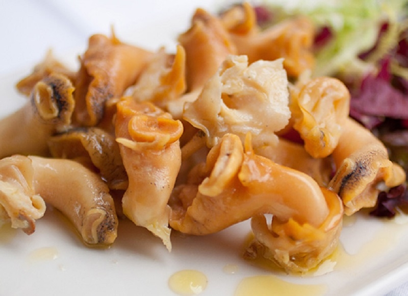

# Салат с трубачом (рапаном)

#### Ингредиенты

* дальневосточный трубач или черноморский рапан 250-300 г
* соевый соус или соус поке
* смесь салатных листьев
* авокадо 1
* огурец 2
* редис 5-6
* консервированная кукуруза
* 1,5 столовые ложки каперсов
* соль и свежемолотый перец

**для заправки:**

* 2-3 ст л оливкового масла
* 1 ст л зерновой горчицы
* 1 ст л лимонного сока

#### Приготовление

Моллюсков разморозить в холодильнике, поместить в ледяную воду, на максимальном огне довести до кипения, тут же снять с огня и промыть холодной водой.  
Готового трубача замариновать в соусе на 2 часа в холодильнике или на час при комнатной температуре.  
Смешать салатные листья, промаринованный трубач, авокадо крупным кубиком, огурцы, редиску, порезанные очень тонкими колечками, пару ложек консервированной кукурузы.

Заправить соусом поке  
ИЛИ  
Приготовить заправку

[_https://t.me/sestrytokarevy_](https://t.me/sestrytokarevy)
